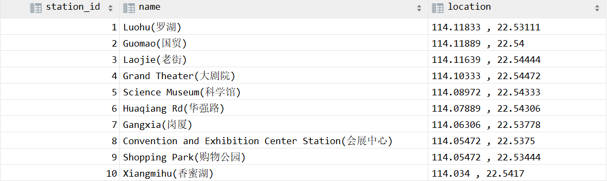
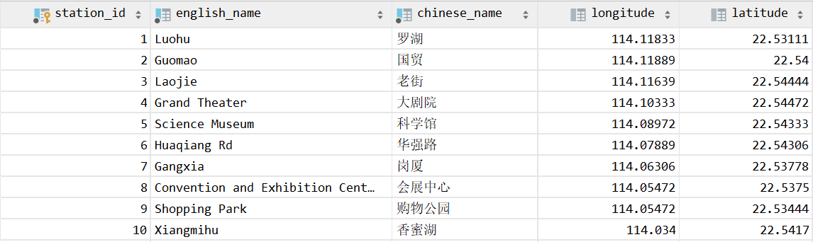
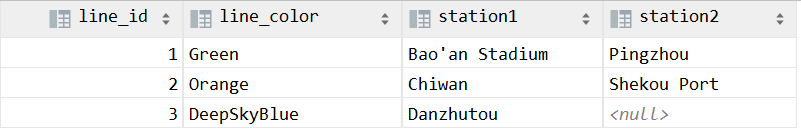
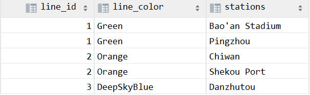
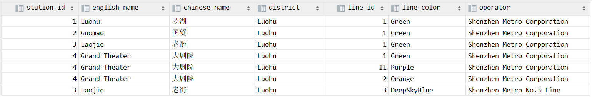
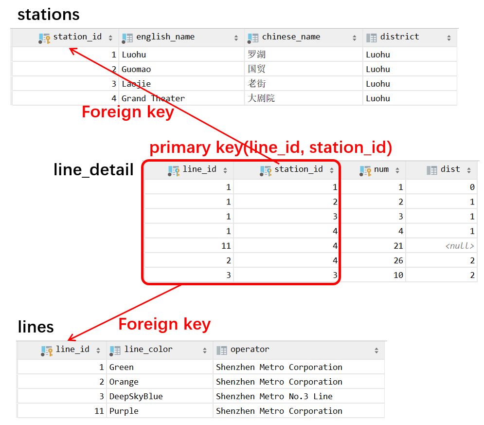
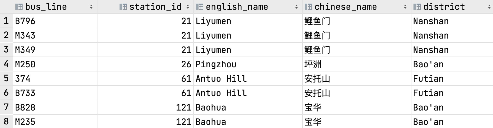
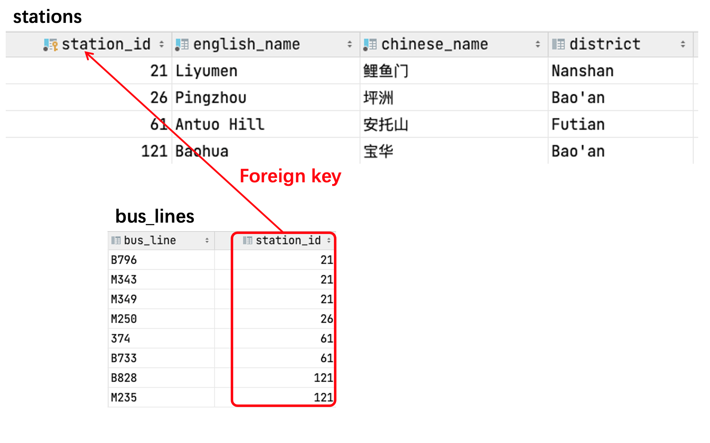
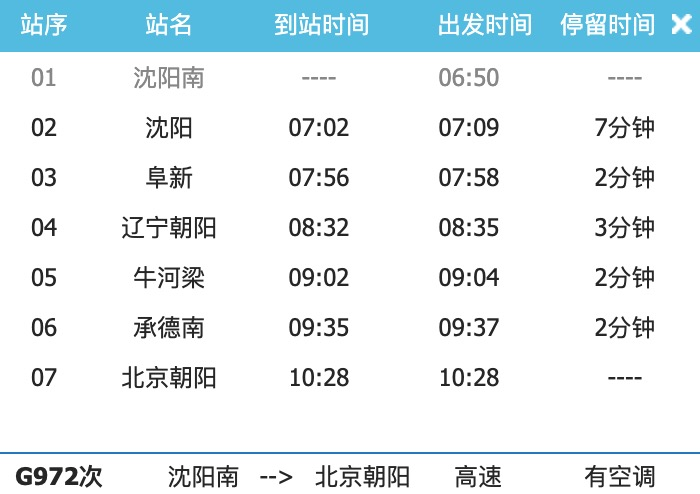
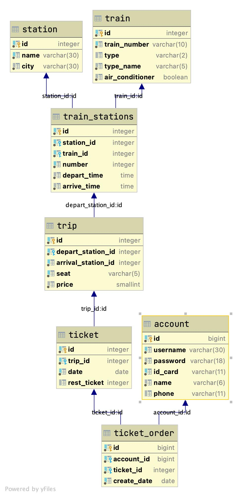

# Tutorial:  Advanced DB Design

> Designed by ZHU Yueming
>
> Update by ZHU Yueming in Mar. 30th 2022.
>
> Update by ZHU Yueming in April. 4th 2023.


## Experimental objective

- Understand 3 normal form of database design
- Learn how to design a database according to the requirement document

##  1. Normal Form

### 1 NF

A relation is in first normal form if and only if the domain of each attribute contains only **atomic** (indivisible) values, and the value of each attribute contains only **a single value** from that domain. 

Comparison 1:

The first one doesn’t satisfy 1NF, because the attribute is not atomic. More specifically, the name can be split to English name and Chinese name, location can be split to longitude and latitude. 

First:



Improved:



Comparison 2:

The first one doesn’t satisfy 1NF, because the stations has more value of the domain, more specifically, 

column station1 and station2 are similar, so that we should merge them into one column.

First:



Improved:



### 2 NF

 A relation satisfying 2NF must:

- be in 1NF 
- not have any non-prime attribute that is dependent on any proper subset of any [candidate key](https://en.wikipedia.org/wiki/Candidate_key) of the relation. A non-prime attribute of a relation is an attribute that is **not a part of** any candidate key of the relation.

The primary keys in the first table are ```station_id``` and ```line_id```, but the first one is a awful design because the columns ```line_color``` and operator are not related to ```station_id```(primary key) while ```english_name```, ```chinese_name``` and ```distric```t are not related to ```line_id```, so that those attribute is a part of condidate key.

If we want to describe **many-to-many relationship** between two entities, we need to separate those two entities into two tables and then add a relation table to describe the relationship itself (as in the second case).

First:



Improved:



### 3 NF

A relation satisfying 2NF must:

- be in 2NF
- all the attributes in a table are determined only by the candidate keys of that relation and not by any non-prime attributes.

We can see from the figure that the column ```english_name``` ，```Chinese_name```, ```district```  is not related to the primary key ```bus_line``` directly. Those columns are more suitable for describing ```station_id```. In this case, we'd better create two tables, the first one is ```station``` and the second is ```bus_line```, and create a foreign key  in bus_line table referencing the station table with station_id.

If we want to describe **one-to-many relationship**, e.g. A only has one B, but B could have more than one A, we can design a foreign key in A table referencing the primary key in B table.

First:



Improved:



## 2. Comprehensive Exercise 12306

**Background**

As we know, the China's rail network is complex, more than 5000 station distribute in 657 citys and connected by 140000km railway. There are so many passengers take the train each day and processing these informations is a real challeng. You, a SUSTech student who want to design a **similarly** database about 12306 according to following **simplified** requirements.

#### Before Start

Although there are standards, database designing is still a highly subjective intellectual activity. As graders, we will set some rules for grading, but as long as your design can satisfy our requirements, you should be able to get the points. Since table name and field name is case-insensitive, it is recommended to use underline “_” to separate words, instead of using camel naming.(e.g. ``Use my_great_table`` , ```some_informative_field``` instead of ```MyGreateTable```or ```SomeInformativeField``` .) 

Example fields are only for reference. You may create new fields and combine/separate these fields to simplify your design, but the information needs to be remained at least

#### DETAILS ABOUT THE RELATIONSHIPS

Store data about rail lines and rail station in an organized and easy-to-maintain manner (see the keywords below).  Following keywords only express what it is, how to create tables and fields are determined by your design.

- City and Station 
  - A city have multiple rail stations 
  - A city can have no stations 
  - A station must be in a city

- Train and Station
  - A train has a train number and its own type with the type name (动车D、特快 T、高速 G、 GC-高铁、 null 其他)
  
  - A train has its depart station and arrival station
  
  - A train need provide the info of whether has air conditioner
  
  - There are several stations in one train
  
  - In a train, for each halfway station, we can find the last station, the next station, and the arrival time depart time for each station.
  
    
- Trip
  - A trip has the a train number, and departure station, arrival station with their time.
  
  - A trip has its own price, and the price of different seat type in one train is different
  
- Ticket
  - A concrete trip in concrete date. For example, "G74" in Feb. 28th or Feb. 29th. 
  
  - Needs the datetime. 

  - Need seat type and price... or other you think is necessary like the graph below
  
    
  
- Account

  - Serves as 12306 account, includes username and password.
  - Account must record it's ID card, the ID card number may have a 'x' in its last digit. 
  - Needs phone number.
  
- Order

  - The Order should record account user, create date, order status, train num, the depart city, arrive city and price, etc.

    

### Sample Answer

