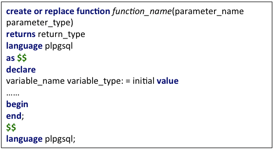
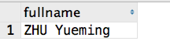
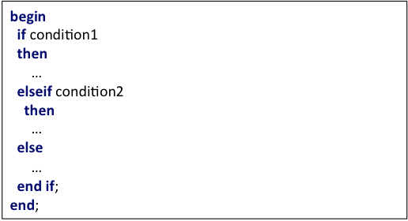
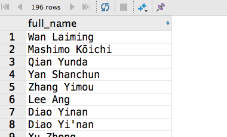
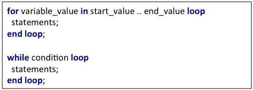
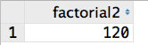

# Tutorial: Function in PostgreSQL

> Designer : ZHU Yueming in 2019.  Improved in 2021. April 19th.
>
> Reference some of queries from the teaching materials of Stephane Faroult.
>
> Other references:
>
> 1. [Return a Result Set from a Stored Procedure](https://www.sqlines.com/postgresql/how-to/return_result_set_from_stored_procedure)
>
> 2. [Set Returning Function](https://www.postgresql.org/docs/13/functions-srf.html)

## Experimental-Objective

1. Introduce more library functions in postgreSQL
2. Learn how to create your function
3. Have ability to complete complex questions about function

## PART 1: PostgreSQL Defined Functions

### 1. Set Returning Function

Possibly return more than one row. Following description and examples are all referenced from  [official document](https://www.postgresql.org/docs/13/functions-srf.html)

| Function Description                                         |
| ------------------------------------------------------------ |
| `generate_series` ( *`start`* `integer`, *`stop`* `integer` [, *`step`* `integer` ] ) → `setof integer generate_series` ( *`start`* `bigint`, *`stop`* `bigint` [, *`step`* `bigint` ] ) → `setof bigint generate_series` ( *`start`* `numeric`, *`stop`* `numeric` [, *`step`* `numeric` ] ) → `setof numeric` |
| `generate_series` ( *`start`* `timestamp`, *`stop`* `timestamp`, *`step`* `interval` ) → `setof timestamp generate_series` ( *`start`* `timestamp with time zone`, *`stop`* `timestamp with time zone`, *`step`* `interval` ) → `setof timestamp with time zone` |

Try following queries about generate numbers:

```sql
SELECT * FROM generate_series(1,30);
SELECT * FROM generate_series(5,1,-2);
SELECT * FROM generate_series(4,3);
SELECT * FROM generate_series(4,5);
```

Try following query about generate date:

```sql
SELECT current_date + date_table.interval AS dates
FROM generate_series(0, 28, 7) as date_table(interval);
```

result:

| dates      |
| :--------- |
| 2021-04-19 |
| 2021-04-26 |
| 2021-05-03 |
| 2021-05-10 |
| 2021-05-17 |

Try following query about generate time:

```sql
SELECT * FROM generate_series('2021-04-10 16:20'::timestamp,
                     '2021-04-10 18:10', '25 minutes');
```

Result:

|      generate_series       |
| :------------------------: |
| 2021-04-10 18:00:00.000000 |
| 2021-04-10 17:35:00.000000 |
| 2021-04-10 17:10:00.000000 |
| 2021-04-10 16:45:00.000000 |
| 2021-04-10 16:20:00.000000 |

### 2. split_part()

 splits a string on a specified delimiter and returns the nth substring.

```
splite_part(varchar <source text>, varchar <delimiter text>,int <field
serial number>)
```

If you need to split the title Feel relaxed studying database by a space into 4 different rows, what you plan to do?

Try following queries:

```sql
select split_part('Feel relaxed studying database',' ',1);
select split_part('Feel relaxed studying database',' ',2);
select split_part('Feel relaxed studying database',' ',3);
select split_part('Feel relaxed studying database',' ',4);
```

Results are  only one row in each separate result set as follows：

```
Feel
relaxed
studying
database
```

Suppose select ```split_part('Feel relaxed studying database',' ',n);``` as a table named ```t1```, and ```generate_series(1, 4);``` as a table named ```t2```, what the result set of cross join of those two table?

```sql
select split_part(t1.words, ' ', t2.number)
from (select cast('Feel relaxed studying database' as text)) t1(words)
         cross join generate_series(1, 4) as t2(number);
```

We can replace 4 with ```length(t1.words)-length(replace(t1.words,' ',''))+1```

```sql
select split_part(t1.words, ' ', t2.number)
from (select cast('Feel relaxed studying database' as text)) t1(words)
         cross join generate_series(1, length(t1.words) -
                                       length(replace(t1.words, ' ', '')) + 1) as t2(number);
```

Results:

| split_part |
| ---------- |
| Feel       |
| relaxed    |
| studying   |
| database   |


### 3. substr()

Get the substring according to the length from the begin position.

```sql
substr(varchar <source text>, int <begin position>, int <length>)
```

Try following queries

```sql
select substr('Feel relaxed studying database', 1, 1);
select substr('Feel relaxed studying database', 2, 1);
select substr('Feel relaxed studying database', 3, 1);
select substr('Feel relaxed studying database', 4, 1);
```

Results are only one character in one row in each separate result set as follows：

```
F
e
e
l
```

In the same way, if we want to get a table of all characters from a text, we can do as follows:

```sql
select distinct substr(character_table.cc,num.index,1)
from (select 'Feel relaxed studying database'::text ) as character_table(cc)
         cross join
    generate_series(1, length(character_table.cc)) as num(index);
```


### 4.  ascii()

Convert a character to its corresponding ASCII code.

```sql
ascii(char <source char>)
```

Design a query to find all characters and their ```ascii``` code in Feel relaxed studying database in ascending order of ```ascii``` code.

```sql
select distinct ascii(substr(character_table.cc,num.index,1)) as ascii, substr(character_table.cc,num.index,1)
from (select 'Feel relaxed studying database'::text ) as character_table(cc)
         cross join
    generate_series(1, length(character_table.cc)) as num(index)
order by ascii;
```


## PART 2. User Designed Function in PostgreSQL

### 1. general format of postgreSQL function


#### Exercise 1: 

Create a function to calculate the sum of two integer numbers. After your design, you can execute the following query.

```plsql
create or replace function sum_func(a int, b int)
  returns int
language plpgsql
as $function$
begin
  return a + b;
end;
$function$;
```

Test:

```sql
select fun(3,4);
```

#### Exercise 2: 

Create a function named ```fullname```, which has two variables called ```firstname``` and ```secondname``` and return the combination of two variables. After your design, you can execute following queries.

```sql
create or replace function fullname(firstname varchar, secondname varchar)
  returns varchar
language plpgsql
as $function$
declare
  name varchar :=null;
begin
  name := firstname || ' ' || secondname;
  return name;
end;
$function$;
```

Test:

```sql
select fullname('ZHU','Yueming');
```

Result:


### 2. Conditions in procedure


#### Exercise 3:  

Create a function to combine firstname and surname of people according to the people coming from eastern country or western country. 

```sql
create function full_name(p_fn varchar, p_sn varchar, style char)
  returns varchar
as $$
begin
  if upper(style) = 'W'
  then
    return trim(coalesce(p_fn, '') || ' ' || p_sn);
  elseif upper(style) = 'E'
    then
      return trim(p_sn || ' ' || coalesce(p_fn, ''));
  else
    raise exception 'Style must be W or E';
  end if;
end;
$$
language plpgsql;
```

Test:

```sql
select full_name(p.first_name, p.surname, 'E')
from people p
  join credits c on p.peopleid = c.peopleid and c.credited_as = 'D'
  join movies m on m.movieid = c.movieid
where m.country = 'cn';
```

Result:



### 3. Loop in procedure



#### Exercise 4:  

Find the factorial of number

```sql
create or replace function factorial(number int)
  returns int
language plpgsql
as $function$
declare result int;
begin
  result = 1;
  for i in 1 .. number loop
    result = result * i;
  end loop;
  return result;
end;
$function$;
```

or

```sql
create or replace function factorial2(number int)
  returns int
language plpgsql
as $function$
declare
  result int;
  i      int;
begin
  result = 1;
  i = 1;
  while i <= number loop
    result = result * i;
    i = i + 1;
  end loop;
  return result;
end;
$function$;
```

Test:

```sql
select factorial2(5);
```

Result:



### 4. Return a table from function

The structure:

```plsql
create function fun_name(arg1 type1, ...)
   returns
   	  table(
   	  	 col_name1 col_type,
   	  	 col_name2 col_type.
   	  	 ......
   	  )
   as
   $$
   begin
   		return query select col1,col2 from ...;
   end;
   $$
   language plpgsql;
```

The column type of result set should be same as the type of return table exactly, more specifically, the type of col1 should be same as the first col_type, and the type of col2 should be same as the second col_type.

#### Exercise 5:

Design a function to return a table that contains all characters and their ```ascii``` code from a pattern string in ascending order of ```ascii``` code.

```plsql
create function character_table(pattern varchar)
    returns table
            (
                chr   char,
                ascii int
            )
as
$body$
begin
    return query
        select distinct (substr(t1.title, t2.index, 1)::char)   chr,
                        ascii(substring(t1.title, t2.index, 1)) ascii
        from (select pattern) t1(title)
                 cross join generate_series(1, length(pattern)) t2(index)
        order by ascii;
end;
$body$
language plpgsql;
```

Then you can test the function as

```sql
select * from character_table('I love database!');
```

### 5. Return cursor for large result set

If the result set of your sql function is too large that it may have a memory overflow error, you can returns a reference of your result set to cursor so that it is an effective way to solve the problem. 

Materials in this part mainly referenced from  [How to Return a Result Set](https://www.sqlines.com/postgresql/how-to/return_result_set_from_stored_procedure)

**The structure of return single result set:**

```plsql
create function fun_name(arg1 type1, ...)
   returns
   		refcursor
   as
   $$
   declare
   	ref refcursor; -- Declare a cursor variable
   begin
   		open ref for select col1,col2 from table.....;-- Open a cursor
   		return ref; --  Return the cursor to the caller
   end;
   $$
   language plpgsql;
```

**Structure of return multiple result sets:**

To return multiple result sets, specify *```SETOF refcursor```* return type and use *```RETURN NEXT```* to return each cursor:

```plsql
create function fun_name(arg1 type1, ...)
   returns
   		SETOF refcursor
   as
   $$
   declare
   	ref1 refcursor; -- Declare a cursor variable1
   	ref2 refcursor; -- Declare a cursor variable1
   begin
   		open ref1 for select col1,col2 from table.....;-- Open a cursor1
   		return next ref1; --  Return the cursor to the caller
   		
   		open ref2 for select col1,col2 from table.....;-- Open a cursor2
   		return next ref2; --  Return the cursor to the caller
   end;
   $$
   language plpgsql;
```

Features:

- Return multiple result sets
- Cursor Lifetime: Until the end of transaction
- Auto-commit: Must be **off**

#### Exercise 6:

Example: rewrite the function in exercise 5, and returns a cursor replaced.

```plsql
create function character_cursor(pattern varchar)
    returns refcursor
as
$body$
declare
    ref refcursor;
begin
    open ref for
        select distinct (substr(t1.title, t2.index, 1)::char)   chr,
                        ascii(substring(t1.title, t2.index, 1)) ascii
        from (select pattern) t1(title)
                 cross join generate_series(1, length(pattern)) t2(index)
        order by ascii;
    return ref;
end;
$body$
    language plpgsql;
```

The process of using cursor:

1. Start a transaction:

   ```sql
   begin;
   ```

2. Get cursor of the function

   ```sql
   select character_cursor('I love database!');
   ```

   The return result is:

   ```sql
   <unnamed portal 2>
   ```

3. Fetch all result set from ```<unnamed portal 2>```

   ```sql
   fetch all in "<unnamed portal 2>";
   ```

4. Commit transaction:

   ```
   commit;
   ```
