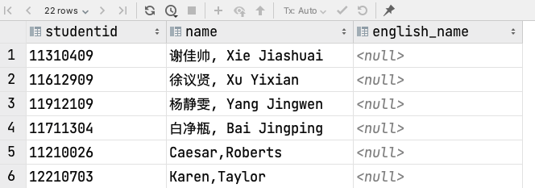
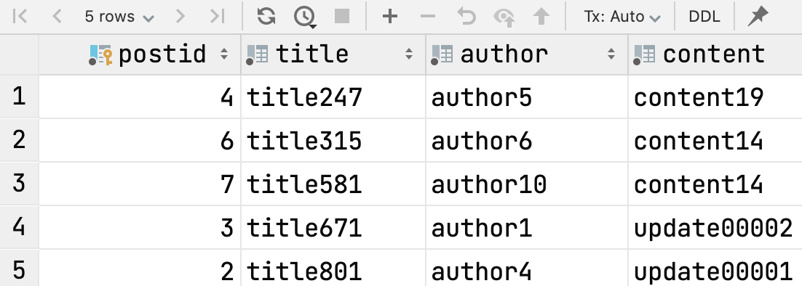
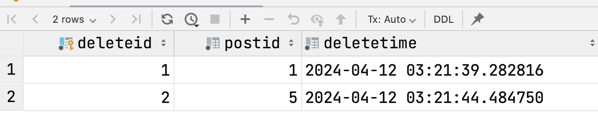

# Tutorial of Function in PostgreSQL

>  Improved by ZHU Yueming in 2021. April 23th.
>
>  Improved by ZHU Yueming in 2024. April 11th.
>
>  The before trigger example is based on the teaching materials of Stephane Faroult.
>
>  The after trigger example is based on the assignment in 2023 Spring semester.

## Experimental-Objective

1. Learn how to create before trigger 

2. Learn how to create after trigger

## Trigger

>When are triggers fired? "During the change" is not a proper answer. In fact, depending on what the trigger is designed to achieve, it may be fired by various events and at various possible precise moments.

If we use an INSERT ... SELECT ... statement, we have ONE statement that inserts SEVERAL rows. If we activate a procedure, what will happen?<br>

```sql
insert into movies
select *
from films_francais
where year_released = 2010;
```

One thing you can sometimes do is fire the procedure only once for the statement, either BEFORE the first row is inserted, or AFTER the last row is inserted.<br>

OR (and it's sometimes the only option) you can call the procedure before or after you insert EACH row, in which case it will be executed a far greater number of times.<br>

**Before Trigger**

```plsql
create trigger trigger_name
    before insert or update or delete
    on table_name
    for each row
    ......
execute procedure procedure_name();
```

**After Trigger**

```plsql
create trigger trigger_name
    after insert or update or delete
    on table_name
    for each row
    ......
execute procedure procedure_name();
```

**new and old**

| Name | Description                                            |
| ---- | ------------------------------------------------------ |
| new  | After execute the query, the value of a row.           |
| old  | Before execute the query, the original value of a row. |


### Before trigger example

This example illustrates how sometimes you can still use programs for which you haven't the source code after you have modified the structure of the database.
I must emphasize that this is a "work around", the proper solution is of course to modify the programs, not to use triggers that inflict a severe performance penalty. BUT sometimes you have little choice and this may save the day.

#### Step1: Create a Students table

```sql
create table if not exists students
(
  studentid varchar(10) not null primary key,
  name      varchar(50) not null,
  english_name varchar(50)
);
```

#### Step2: Try to import data

```sql
insert into Students (studentid, name) values('11310409','谢佳帅, Xie Jiashuai');
insert into Students (studentid, name) values('11612909','徐议贤, Xu Yixian');
insert into Students (studentid, name) values('11912109','杨静雯, Yang Jingwen');
insert into Students (studentid, name) values('11711304','白净瓶, Bai Jingping');
insert into Students (studentid, name) values('11210026','Caesar,Roberts');
insert into Students (studentid, name) values('12210703','Karen,Taylor');
insert into Students (studentid, name) values('12010225','Frankie,Wright');
insert into Students (studentid, name) values('11811901','贺子珍, He Qizhen');
insert into Students (studentid, name) values('11912623','魏毛安, Wei Maoan');
insert into Students (studentid, name) values('11610927','Dustin,Clarke');
insert into Students (studentid, name) values('12211621','靖慕华, Jing Muhua');
insert into Students (studentid, name) values('11512115','Undine,Taylor');
insert into Students (studentid, name) values('11612806','孙年蓝, Sun Nianlan');
insert into Students (studentid, name) values('11211620','Jackie,Thomas');
insert into Students (studentid, name) values('12012421','Fidelia,Wilson');
insert into Students (studentid, name) values('11911120','Phoebe,Smith');
insert into Students (studentid, name) values('11511710','尤向欣, You Xiangxing');
insert into Students (studentid, name) values('11512206','李如风, Li Rufeng');
insert into Students (studentid, name) values('11510326','Theo,White');
insert into Students (studentid, name) values('11211016','Theodoric,Hughes');
insert into Students (studentid, name) values('11112504','Dermot,Lewis');
insert into Students (studentid, name) values('11611508','Martina,Patel');
```

The result will be:




#### Step3: Create a trigger when insert a row, it can separate English name from "name"

Do the query below to clear the table:

```sql
truncate students;
```

In this case, we first need to analyze whether this student is a Chinese student or an international student. If he/she is a Chinese student, split the Chinese and English names directly. If he/she is an international student, please convert his/her surname to upper case letter in the column of his/her English name.

```plsql
create or replace function new_design()
    returns trigger
as
$$
declare
    s_name students.name%type;
begin
    s_name := new.name;
    if ascii(s_name) between 19968 and 40959
    then
        -- Chinese name
        new.name := trim(split_part(s_name, ',', 1));
        new.english_name := trim(split_part(s_name, ',', 2));
    else
        -- International student.
        -- Don't change name, modify for English name
        new.english_name := trim(upper(trim(split_part(s_name, ',', 1)))
                                     || ' ' || trim(split_part(s_name, ',', 2)));
    end if;
    return new; -- modified
end;
$$
    language plpgsql;
```

- ```students.name%type``` means: Given the variable ```s_name``` a type as the column type of name in students table.
- ```new``` means: the new inserted row in students table.
- ```return new``` means: In the function, we change the value of the new inserted row, and return the ```new``` is to insert the changed row into students table.

**create_trigger.sql**
creates the trigger. Note that if we insert something into english_name, it won't fire.

```plsql
create trigger students_trg
  before insert
  on students
  for each row
  when (new.english_name is null) -- Only for insert statements
  -- unaware of the new table structure
execute procedure new_design();
```

#### Step 5. Execute the insert command again.


### After trigger example

####  Create those three tables

```sql
CREATE TABLE Post (
    PostID SERIAL PRIMARY KEY,
    Title VARCHAR(255) NOT NULL,
    Author VARCHAR(255) NOT NULL,
    Content TEXT NOT NULL
);
CREATE TABLE PostRevision (
    RevisionID SERIAL PRIMARY KEY,
    PostID INT NOT NULL,
    RevisionDate TIMESTAMP NOT NULL,
  	OldVersionContent TEXT NOT NULL,
    NewVersionContent TEXT NOT NULL
);
CREATE TABLE DeleteLog (
    DeleteID SERIAL PRIMARY KEY,
    PostID INT NOT NULL,
    DeleteTime TIMESTAMP NOT NULL
);
```

Given the three data tables above, please implement the following two PostgreSQL Triggers:

1. When the Content column in the Post table is updated, automatically add a row to the ```PostRevision``` table, recording the updated ```PostID```, the ```current time``` as the revision time, and the ```updated content```.
2. When a row in the ```Post``` table is deleted, automatically delete all related revision records according to ```PostID``` in the ```PostRevision``` table and add a row to the ```deleteLog``` table, recording to ```deletion time``` and the ```deleted PostID```.

#### Step 1. Design the function:

```plsql
CREATE OR REPLACE FUNCTION post_revision()
    RETURNS trigger AS
$$
begin
    if TG_OP = 'UPDATE'
    then
        if (New.content <> Old.content)
        then
            insert into PostRevision (PostID, RevisionDate, OldVersionContent, NewVersionContent)
            values (NEW.PostID, NOW(), OLD.Content, NEW.Content);
        end if;
    elseif
        tg_op = 'DELETE'
    then
        delete from PostRevision where PostID = OLD.PostID;
        insert into DeleteLog (PostID, DeleteTime)
        values (OLD.PostID, NOW());
    end if;
    return null;
end;
$$ LANGUAGE plpgsql;
```

- What is ```TG_OP``` : It is the DML manipulation of table. ```if TG_OP='UPDATE'```  means when it does the update manipulation , it will go into the if block.
- ```New``` and ```Old```:  Those are the value of specific row in Post table. The value of before update or delete manipulation is the old value. The value of after update of delete manipulation is the new value.
- ```return null;``` means no other change of the ```Post``` table. The trigger only change the value of ```PostRevision``` table and ```DeleteLog``` table.

#### Step 2. Design the Trigger

```plsql
create trigger post_row
    after update or delete
    on post
    for each row
execute procedure post_revision();
```

- The trigger should high light the manipulation like ```update``` and ```delete```
- Do not forget add ```for each row```

#### Test Data:

```sql
INSERT INTO Post (Title, Author, Content) VALUES ('title511', 'author2', 'content17');
INSERT INTO Post (Title, Author, Content) VALUES ('title801', 'author4', 'content19');
INSERT INTO Post (Title, Author, Content) VALUES ('title671', 'author1', 'content18');
INSERT INTO Post (Title, Author, Content) VALUES ('title247', 'author5', 'content19');
INSERT INTO Post (Title, Author, Content) VALUES ('title575', 'author7', 'content17');
INSERT INTO Post (Title, Author, Content) VALUES ('title315', 'author6', 'content14');
INSERT INTO Post (Title, Author, Content) VALUES ('title581', 'author10', 'content14');
UPDATE Post SET Content =  'update13404' WHERE PostID = 1;
UPDATE Post SET Content =  'update11882' WHERE PostID = 2;
UPDATE Post SET Content =  'update00002' WHERE PostID = 3;
UPDATE Post SET Content =  'update00001' WHERE PostID = 2;
DELETE FROM Post WHERE PostID = 1;
DELETE FROM Post WHERE PostID = 5;
```

The result would be:

In post:



In postrevision:


In deletelog:



