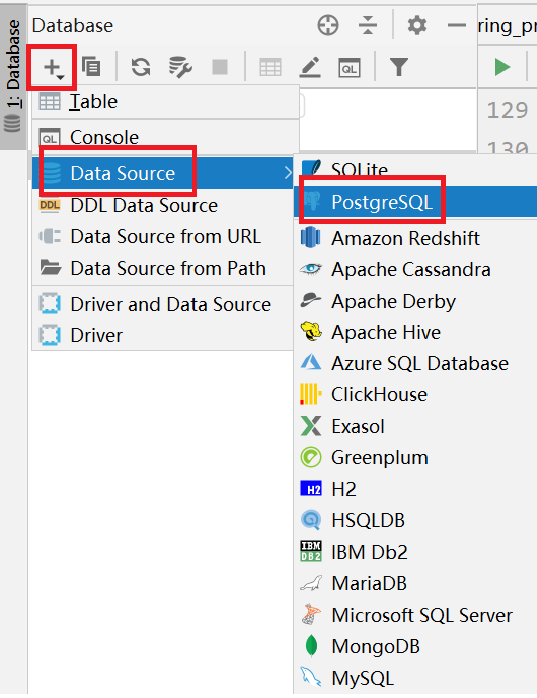
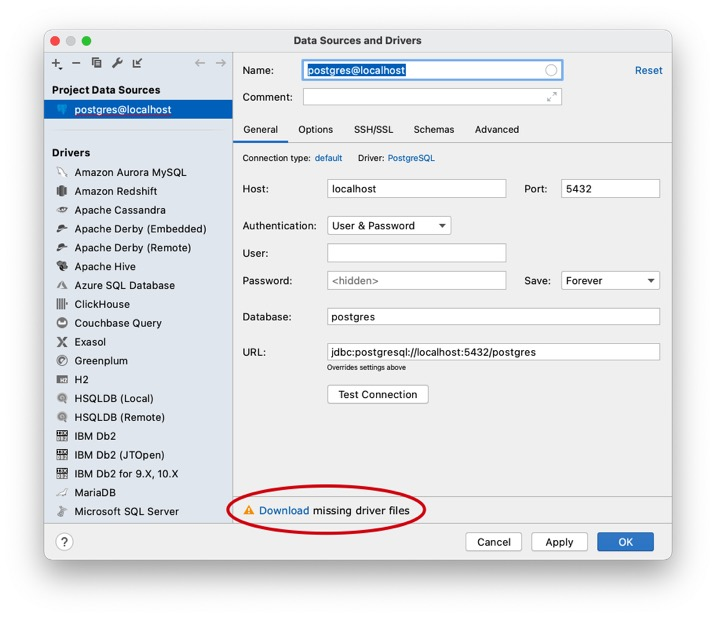
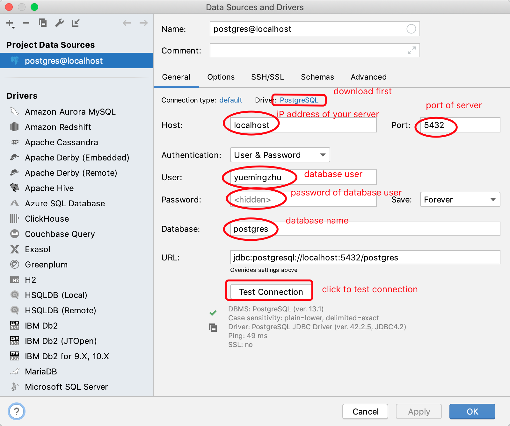
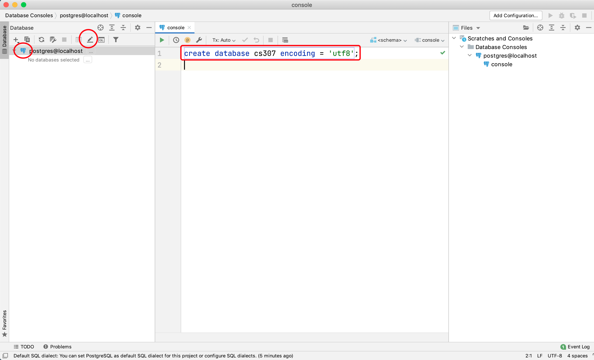
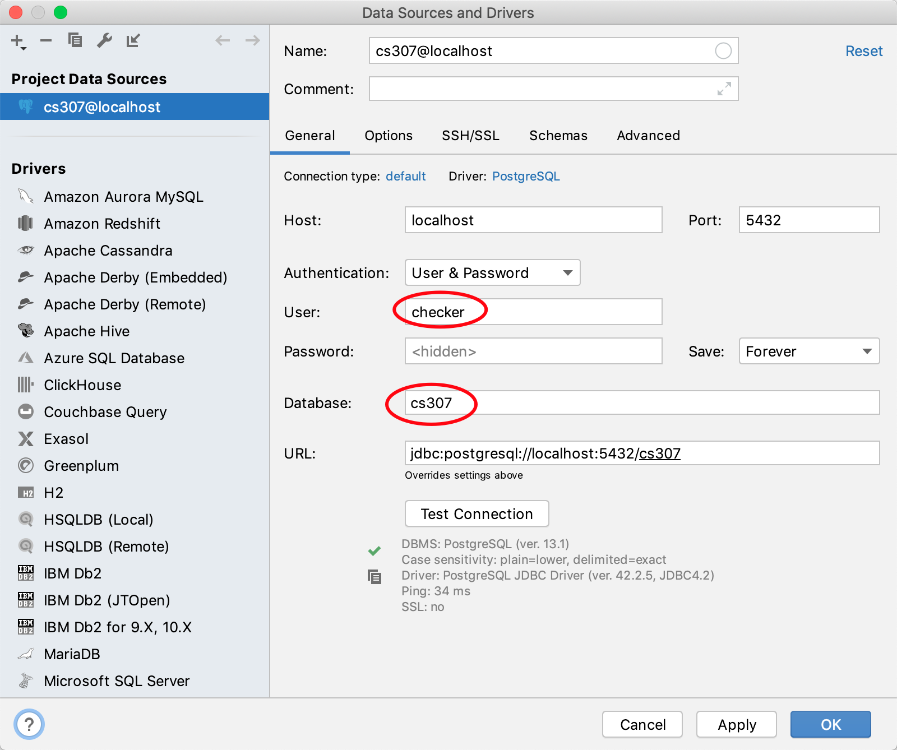
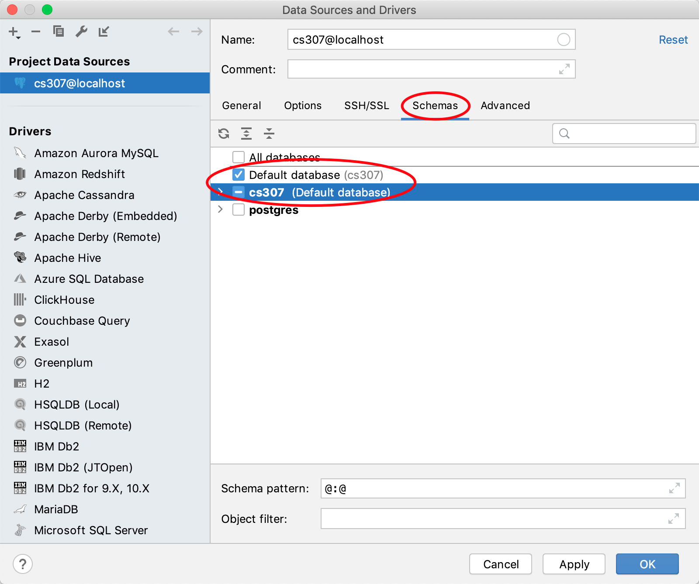

# Tutorial:  Software Installation

> Contributors:
>
> Designed by [ZHU Yueming](mailto:zhuym@sustech.edu.cn) and [WU Yechang](mailto:11711918@mail.sustech.edu.cn) In 2020
>
> Improved by ZHU Yueming and WANG Ziqin in 2021
>
> Improved by ZHU Yueming in 2022
>
> Improved by ZHU Yueming in 2023

- DBMS:  [PostgreSQL](https://www.postgresql.org/)
- Client: [DataGrip](https://www.jetbrains.com/datagrip/)


## Part 1. Environment Configuration

[MacOS user](###MacOS users)

[Linux user](###Linux users)

[Windows user](###Windows users)

[Docker users](###Docker users)

### macOS users

[Back to Environment Configuration](##Part 1. Environment Configuration)

#### 1. Installation & Usage

Here are alternative ways to install PostgreSQL.

##### By Homebrew (Recommended)

###### Step 1. Install [Homebrew](https://brew.sh/).

(If you already have it installed, skip this step.)

1. Prerequisites according to [Requirements](https://docs.brew.sh/Installation):

   1. A 64-bit Intel CPU or Apple Silicon CPU [1](https://docs.brew.sh/Installation#1)
   2. macOS Mojave (10.14) (or higher) [2](https://docs.brew.sh/Installation#2)
   3. Command Line Tools (CLT) for Xcode: `xcode-select --install`, [developer.apple.com/downloads](https://developer.apple.com/downloads) or [Xcode](https://itunes.apple.com/us/app/xcode/id497799835) [3](https://docs.brew.sh/Installation#3)
   4. A Bourne-compatible shell for installation (e.g. `bash` or `zsh`) [4](https://docs.brew.sh/Installation#4)

2. Open the “Terminal” application

3. Enter the following command into a single line of the terminal

   ```bash
   /usr/bin/ruby -e "$(curl -fsSL https://raw.githubusercontent.com/Homebrew/install/master/install)"
   ```

4. If you meet the problem: "Failed to connect to raw.githubusercontent.com port 443: Operation". You can solve it by the <a href="https://www.jianshu.com/p/68efabd2e32b">link</a>.

如果有用mac的同学在装完homebrew后，安装postgresql很慢，可以尝试更换homebrew的源，例如：https://mirrors.tuna.tsinghua.edu.cn/help/homebrew/

###### Step 2.  Install PostgreSQL.

1. Enter the command to update brew home.

   ```
   brew update
   ```

2. Enter the command to install PostgreSQL.

   ```
   brew install postgresql
   ```

3. Check your PostgreSQL version. (Check successfully installed)

   ```
   postgres --version
   ```

4. Note that, after the initial installation, it would generate two elements:

- a <font color='BLUE'>database</font> named `postgres`.

- a <font color='BLUE'>database user</font> named _your system user name_.


###### Step 3. Run `brew info postgres` for details.

1. Manually (will not start after system startup), in command line: 

   ```
   pg_ctl -D /usr/local/var/postgres start # To start
   pg_ctl -D /usr/local/var/postgres stop  # To stop
   ```

2. Automatically (will start after system startup), in command line:

   ```
   brew services start postgresql  # To start
   brew services stop postgresql	  # To stop
   ```

##### By Postgres.app

It is a brand new installation method. It's really simple but there may be some potential issues. Visit [PostgresApp](https://postgresapp.com/) for details and optional versions.

###### Step 1. Installation

1. [Download](https://github.com/PostgresApp/PostgresApp/releases/download/v2.4.1/Postgres-2.4.1-13.dmg) the .dmg file. (Be patient...)
2. Mount the file, move Postgres to Applications folder, and double click Postgres in Applications folder. (Now the dmg file is useless and can be removed.)
3. Click "Initialize" to create a new server.
4. You can change path and port in "Server settings" when stopped.

###### Step 2. Start & Stop

1. Click "Start" to start the server.
2. When server is started, you can open a command line client connected to a schema by double clicking this schema.
3. Click "Stop" to stop the server.

##### By Installer

1. Go to [Postgresql Download Page](https://www.enterprisedb.com/downloads/postgres-postgresql-downloads), download [installer](https://get.enterprisedb.com/postgresql/postgresql-12.1-3-osx.dmg). When the wizard prompts you to choose where to install PostgreSQL, point it to the **apps** subdirectory of your  i.e. /Library/PostgreSQL/12.
3. Keep track of the **database superuser** name and **password**. You'll need these to initially create the LabKey database, the LabKey database user, and grant that user the owner role.
3. Keep track of the **database port**. (5432 for default)

##### By Docker

See [For Docker users](#For Docker users)

#### 2. Uninstallation

##### By Homebrew

```bash
brew uninstall postgres
```

##### By Postgres.app

1. Open _Finder_.
2. Go to _Applications_.
3. Move _Postgres.app_ to _Trash_.

##### By Installer

There is a uninstall-postgresql.app in your installation directory. (i.e. /Library/PostgreSQL/12)

``` bash
open /Library/PostgreSQL/12/uninstall-postgresql.app
```

For rest files, see [this sof answer](https://stackoverflow.com/questions/8037729/completely-uninstall-postgresql-9-0-4-from-mac-osx-lion/9240197#9240197).

##### By Docker

See [For Docker users](#For Docker users)

### Linux users

[Back to Environment Configuration](##Part 1. Environment Configuration)

#### 1. Installation

##### By Package manager

Take **Ubuntu** as an example.

###### Step 1. Run the following command to access each URL in the source list, read the software list, and save it on the local computer.

```bash
sudo apt update
```

###### Step 2. Install PostgreSQL client first

```bash
sudo apt install postgresql-client
```

###### Step 3. Then Install PostgreSQL server

```bash
sudo apt install postgresql
```

###### Step 4. Check your PostgreSQL version. (Check successfully installed)

```
psql --version
```

###### Step 5. Enable and start `postgresql.service`

On Ubuntu, generally the PostgreSQL server will have an initialized database and automatically listen to port <font color='BLUE'>5432</font> after the installation. (Other Linux distributions can behave differently and may require a manual [database initialization](https://www.postgresql.org/docs/current/app-initdb.html).) As Ubuntu employs systemd to manage system services nowadays, you can check the status of the PostgreSQL service with `systemctl`:

```sh
systemctl status postgresql.service
```

As shown below, if `postgresql.service` is active, it is running in the background; If `postgresql.service` is enabled, it launches after system startup.

```javascript
 postgresql.service - PostgreSQL RDBMS
   Loaded: loaded (/lib/systemd/system/postgresql.service; enabled; vendor preset: enabled)
   Active: active (exited) since Wed 2020-12-16 15:53:28 CST; 3 weeks 2 days ago
  Process: 2522 ExecStart=/bin/true (code=exited, status=0/SUCCESS)
 Main PID: 2522 (code=exited, status=0/SUCCESS)
```

Enable `postgresql.service` if it is disabled:

```sh
sudo systemctl enable postgresql.service
```

Start `postgresql.service` if it is not running:

```sh
sudo systemctl start postgresql.service
```

###### Step 6. Note that, after the initial installation, it would generate three elements:

1. a <font color='BLUE'>database</font> named `postgres`.
2. a <font color='BLUE'>database user</font> named `postgres`.
3. a <font color='BLUE'>Linux system user</font> named `postgres`.

##### By Docker

See [For Docker users](#For Docker users)

#### 2. Uninstallation

##### By Package manager

``` bash
sudo apt remove postgresql postgresql-client
```

Note that your data files at `/var/lib/postgresql/` might be kept until you `purge` them.

##### By Docker

See [For Docker users](#For Docker users)

#### 3. Upgrade

Be careful when you want to upgrade your PostgreSQL server to a new **major-version**, especially if you are running a Linux distribution with a rolling release model (e.g., Arch Linux, Manjaro, openSUSE Tumbleweed). Your PostgreSQL server might fail to start after an upgrade because it might require data files in new storage format, which can be incompatible with your existing data in legacy format.

You can follow the instructions in [PostgreSQL documentation](https://www.postgresql.org/docs/current/upgrading.html) to migrate existing data to the new format using tools like `pg_upgrade`.

### Windows users

[Back to Environment Configuration](##Part 1. Environment Configuration)

#### 1. Installation

##### By Installer (Recommended)

1. Go to [Postgresql Download Page](https://www.enterprisedb.com/downloads/postgres-postgresql-downloads), download [installer](https://get.enterprisedb.com/postgresql/postgresql-12.1-3-windows-x64.exe). When the wizard prompts you to choose where to install PostgreSQL, point it to the **apps** subdirectory of your  i.e. C:\labkey\apps\postgresql-10.6\

2. Keep track of the **PostgreSQL Windows Service** account name and password. LabKey Server needs to ask for it so that we can pass it along to the PostgreSQL installer.
3. Keep track of the **database superuser** name and password. You'll need these to initially create the LabKey database, the LabKey database user, and grant that user the owner role.

##### By Chocolatey

If you don't have [chocolatey](https://www.chocolatey.org/), go and get one.

``` powershell
choco install postgresql
```

##### By Docker

See [For Docker users](#For Docker users)

#### 2. Uninstallation

##### Universal way (by installer or choco)

1. Click "Start Menu", Go to "Settings" > "Apps" > "Apps & features".
2. Select "PostgreSQL", click "Remove".

##### By Chocolatey

``` powershell
choco uninstall postgresql
```

##### By Docker

See [For Docker users](#For Docker users)

### Docker users

[Back to Environment Configuration](##Part 1. Environment Configuration)

**If you don't have Docker environment, please choose another installation method.**

#### 1. Installation

In command line:

``` bash
docker run --name some-postgres -p 5432:5432 -e POSTGRES_PASSWORD=mysecretpassword -d postgres
```

Note:

- You may need root privilege to run the above command if the current system user is not a member of the `docker` group.

- By default, Docker persists the data created by a postgres container [in an anonymous docker volume](https://github.com/docker-library/postgres/blob/03e769531fff4c97cb755e4a608b24935ceeee27/13/Dockerfile#L183) on the host machine. You can bind a local directory to store the data by passing an `-v /path/to/dir:/var/lib/postgresql/data` argument.

#### 2. Uninstallation

If your postgres container names "some-postgres"

```bash
docker stop some-postgres # Stop container
docker rm some-postgres   # Remove container
docker rmi postgres       # Remove image
```

Note that volumes are not deleted when containers are removed, unless the `--volumes` option is supplied to `docker rm`.

## Part 2. How to use PostgreSQL

### 1. Prepare Parameters for Database Connection:

Generally, to visit database server, we needs following parameters:

- **Host IP** The IP address of server. ```localhost``` or ```127.0.0.1``` and represents the local ip of your computer.
- **Port**: The port of server. The default port of postgreSQL is ```5432``` .
- **User**: The user of database.
- **Password**: The password of database user.
- **Database**: The database you will to visit. The default database of postgreSQL always be ```postgres```

#### Configuration on macOS

1. <kbd>⌘</kbd>+<kbd>space</kbd> to search and open "Terminal", then input the following command to access your database:

   ```
   psql postgres
   ```

   The system prompt would be <font color='BLUE'>postgres=#</font>, which means you have connected to `postgres` database.

   (Note: `psql` is a command line PostgreSQL client program)

2. Find all roles in PostgreSQL

   ```
   \du
   ```

   It will returns: (`yuemingzhu` is my database user)

   ```
   postgres=# \du
                                       List of roles
    Role name  |                         Attributes                         | Member of 
   ------------+------------------------------------------------------------+-----------
    yuemingzhu | Superuser, Create role, Create DB, Replication, Bypass RLS | {}
   
   (END)
   ```

3. Initial parameters on macOS:

   - **Host IP**: `localhost`
   - **Port**: `5432`
   - **User**: `yuemingzhu` (change it for your username)
   - **Password**: *null*
   - **Database**: `postgres`

#### Configuration on Linux

1. Connect to database `postgres` as `postgres` user:

   ```shell
   sudo -u postgres psql postgres
   ```

   The prompt would become `postgres=#`, which means you have connected to `postgres` database.

   (Note: `psql` is a command line PostgreSQL client program)

2. List all roles in PostgreSQL:

   ```
   postgres=# \du
                                      List of roles
    Role name |                         Attributes                         | Member of 
   -----------+------------------------------------------------------------+-----------
    postgres  | Superuser, Create role, Create DB, Replication, Bypass RLS | {}
   ```

3. Initial parameters on Linux:

   - **Host IP**: `localhost`
   - **Port**: `5432`
   - **User**: `postgres`
   - **Password**: *null*
   - **Database**: `postgres`

#### Configuration on Windows

1. Initial parameters of Windows User:
   - **Host IP**: `localhost`
   - **Port**: `5432`
   - **User**: `postgres`
   - **Password**: *The password you set during the installation process*
   - **Database**: `postgres`

### 2. Datagrip

PostgreSQL is a server, we can visit the server by command, by a script or by a GUI program. In this case, DataGrip is a functional client with GUI platform, and in this course, we recommend you use Datagrip as client program.

Here to [download DataGrip](https://www.jetbrains.com/datagrip/download/), and then install it.

#### How to use DataGrip?

1. Select Data Source

2. Add a client

   

   

3. Download the JDBC driver

   

4. Fill in Host, User, Password and Database, and then click **Test Connection**

   

5. Try to create a database in DataGrip

   ```sql
   create database cs307 encoding='utf8';
   ```

   

6. Find all databases

   ```sql
   select datname from pg_database;
   ```

7. Try to create a superuser

   ```sql
   create user checker superuser password '123456';
   ```

   A new user named ```checker``` has been created with the password ```123456```

8. Change to another database ```cs307```

   

   Check: the default database should be cs307

   

9. Try to create a table in public schema

   ```sql
   create table lab(
       id serial primary key,
       address varchar(20) not null,
       time varchar(20) not null,
       capacity int,
       teacher varchar(20),
       unique (address,time)
   );
   ```

10. Insert data into lab table

    ```sql
    insert into lab (address, time, capacity, teacher) values ('508','2-78',36,'yueming');
    insert into lab (address, time, capacity, teacher) values ('508','2-56',36,'yueming');
    insert into lab (address, time, capacity, teacher) values ('508','3-56',36,'yueming');
    insert into lab (address, time, capacity, teacher) values ('510','4-34',36,'yueming');
    ```

    Then select to check them

    ```sql
    select * from lab;
    ```

11. Update data

    ```sql
    update lab set address='510' where time = '3-34';
    ```

    Then select to check it

    ```sql
    select * from lab where time = '3-34';
    ```

12. Delete data

    ```sql
    delete from lab where time = '2-56';
    ```

    Then select to check it

    ```sql
    select * from lab;
    ```


## Part 3. Exercise

1.  Install PostgreSQL in your own computer (any system can be accepted).

2. Create a database named <font color='BLUE'>cs307</font> with a owner named <font color='BLUE'>checker</font>.

4. Use your DataGrip to connect database cs307.

4. Access PostgreSQL database by network, i.e. to connect to database <font color='BLUE'>cs307</font> from another IP address instead of 127.0.0.1 , as long as we know your <font color='BLUE'>IP address</font> and username (<font color='BLUE'>checker</font>). Now, you can search for any solutions to accomplish this task, and I think you, to be a student of CSE, can accomplish this task.

   Hints: Find ```pg_hba.conf``` ```postgresql.conf``` file in your psql installation catalog.

   Installation catalog for Linux:  ```/etc/postgresql/12/main```

   Installation catalog for MacOS:```/usr/local/var/postgres```

   Installation catalog for windows: ```C:\Program Files\PostgreSQL\13\data```

   


