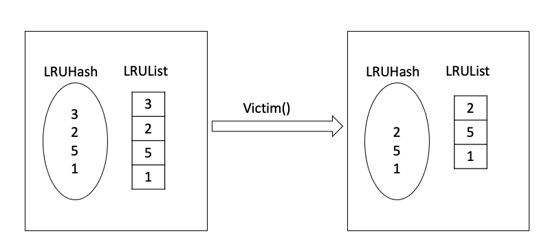
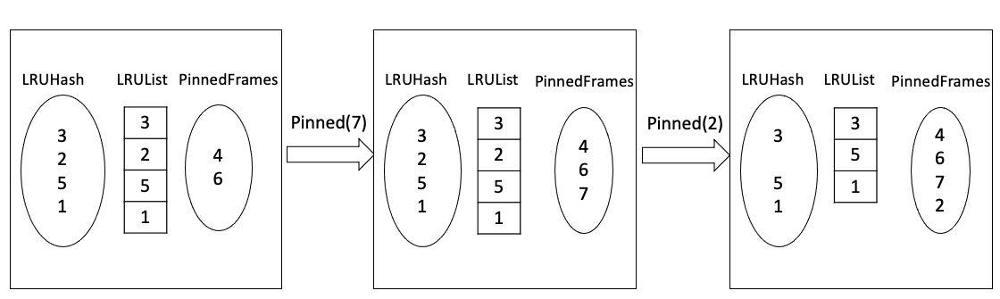
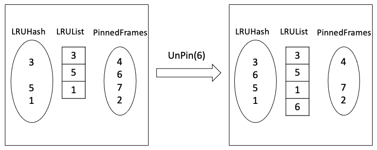

# LRU (Least Recently Used)

> Desinged by ZHU Yueming in April 15th 2025.
>
> Some of documents refer to deepseek

## 1. General Principle of LRU

### 1. The basic principle of LRU algorithm

The **Least Recently Used (LRU)** algorithm is a widely used **cache eviction policy** that removes the least recently accessed items when the cache is full. It operates on the principle that:

- **Recently accessed data is more likely to be used again soon.**
- **Older (less recently used) data can be safely removed to make space for new entries.**

**Key Idea:**

- Maintain an ordered list of cached items, where:
  - The **head** represents the **most recently used (MRU)** item.
  - The **tail** represents the **least recently used (LRU)** item.
- When the cache reaches capacity, the **LRU item is evicted first**.

### 2. Example of LRU

Here's the **Hash Set representation** of the LRU cache operations, showing how the set changes with each access while maintaining the same eviction behavior as the doubly-linked list implementation:

### LRU Cache Simulation (Hash Set + Linked List View)

**Cache Capacity = 3**
**Access Sequence:** `1 → 3 → 4 → 2 → 3 → 4 → 5 → 2 → 1`

| Step | Access | Hash Set Contents | Linked List Order (MRU→LRU) | Action Taken                   |
| :--- | :----- | :---------------- | :-------------------------- | :----------------------------- |
| 1    | 1      | {1}               | [1]                         | Insert 1                       |
| 2    | 3      | {1, 3}            | [3, 1]                      | Insert 3                       |
| 3    | 4      | {1, 3, 4}         | [4, 3, 1]                   | Insert 4                       |
| 4    | 2      | {2, 3, 4}         | [2, 4, 3]                   | **Evict 1**, Insert 2          |
| 5    | 3      | {2, 3, 4}         | [3, 2, 4]                   | 3 already in set - move to MRU |
| 6    | 4      | {2, 3, 4}         | [4, 3, 2]                   | 4 already in set - move to MRU |
| 7    | 5      | {4, 5, 3}         | [5, 4, 3]                   | **Evict 2**, Insert 5          |
| 8    | 2      | {4, 5, 2}         | [2, 5, 4]                   | **Evict 3**, Insert 2          |
| 9    | 1      | {1, 4, 2}         | [1, 2, 5]                   | **Evict 4**, Insert 1          |

1. **Hash Set Role**:
   - The `HashSet` (here: `{...}`) **tracks which pages are currently in cache** for O(1) lookups.
   - It **does not track order** - order is maintained by the linked list.
2. **Linked List Role**:
   - The `LinkedList` (here: `[...]`) **maintains access order** (MRU→LRU).
   - Every access (hit or miss) updates the list.
3. **Eviction Logic**:
   - When inserting a new page:
     - If cache is full, the **rightmost (LRU) item in the linked list** is evicted.
     - The evicted page is **removed from both the set and the list**.
4. **Access Hits**:
   - If a page exists in the set (e.g., Step 5: accessing `3`), it is **moved to the head of the list** (MRU) but the set remains unchanged.

### 3. Implementation of LRU algorithm

You can design:

 ```Set<Integer>``` : To Quickly determine whether a key exists (the `contains(key)` operation is O(1))

```List<Integer>```: Maintain access order, where the **head** represents the **Most Recently Used (MRU)** item, and the **tail** represents the **Least Recently Used (LRU)** item

```java
import java.util.ArrayList;
import java.util.HashSet;
import java.util.LinkedList;
import java.util.List;
import java.util.Set;

public class LRUCache {
  private final int capacity;
  private final Set<Integer> set;
  private final LinkedList<Integer> list;
  public LRUCache(int capacity) {
    this.capacity = capacity;
    this.set = new HashSet<>();
    this.list = new LinkedList<Integer>();
  }
  public void access(int key) {
    if (set.contains(key)) {
      list.removeFirstOccurrence(key);
      list.addFirst(key);
    } else {
      if (set.size() >= capacity) {
        int lruKey = list.removeLast();
        set.remove(lruKey);
      }
      set.add(key);
      list.addFirst(key);
    }
  }
  public String getCacheState() { return list.toString(); }
  public static void main(String[] args) {
    LRUCache cache = new LRUCache(3);
    int[] accesses = {1, 3, 4, 2, 3, 4, 5, 2, 1};
    System.out.println("Step\tAccess\tCache State (MRU→LRU)");
    for (int i = 0; i < accesses.length; i++) {
      cache.access(accesses[i]);
      System.out.printf("%d\t%d\t%s\n", i + 1, accesses[i],
                        cache.getCacheState());
    }
  }
}

```

**Core Method Logic: `access(int key)`**

Cache Hit (Key Exists)

- Remove the key from the linked list and reinsert it at the head (using `removeFirstOccurrence(key)` + `addFirst(key)`).

Cache Miss (Key Does Not Exist)

- If the cache is full
  - Remove the **tail (LRU)** from the linked list.
  - Synchronously remove it from the `HashSet`.

- Insert the new key
  - Add the key to the **head of the linked list (MRU)**.
  - Insert it into the `HashSet`.

### 4. Application scenarios of LRU algorithm

1. **Database Caching (e.g., MySQL Buffer Pool)**
   - Keeps frequently accessed database pages in memory.
   - Evicts least recently used pages when space is needed.
2. **Operating System Page Replacement**
   - Decides which memory pages to swap out to disk.
   - Prevents thrashing by retaining recently used pages.
3. **Web Browsers & CDNs**
   - Caches frequently visited websites or resources.
   - Uses LRU to discard old cached content.
4. **CPU Cache Management**
   - Optimizes cache hits by retaining recently accessed data.
5. **Distributed Caching (Redis, Memcached)**
   - Implements LRU to manage memory usage across clusters.

## 2. PinnedFrames in LRU

`pinnedFrames` is a collection of **pinned pages** that currently **cannot be evicted by the LRU algorithm** (e.g., database pages being modified by transactions). Its core functionality includes:

### 1. Why Do We Need `pinnedFrames`?

#### (1) Typical Use Cases

Database Buffer Pool.

Operating System Page Cache.

#### (2) Problems Without `pinnedFrames`

If LRU evicts actively used pages:
- Database transactions may fail (due to dirty page loss).
- System crashes may occur (when the kernel accesses invalid memory).

### 2. Mainstream Design Approaches

**Separate LRU and Pinned Collections**

- **LRU Linked List**: Manages only **evictable pages** (those not pinned).
- **Pinned Collection**: Stores all pinned pages (typically implemented with `HashSet` or `HashMap`).
- **Operation Logic**:
  - `Pin(frameId)`: Removes the page from LRU and adds it to `pinnedFrames`.
  - `Unpin(frameId)`: Removes the page from `pinnedFrames` and adds it back to LRU.

### Exercise

In the framework we provide, please complete the following three methods in class ```LRUReplacer```  as required and passed the JUnit test. The description is as follows:

**1. public int Victim() **

Remove the least frequently used page from LRU. 

By default, LRUList adds the latest page at the end and removes the least frequently used page at the beginning. If the process is normal, the corresponding frameId is returned, otherwise -1 is returned



**2. public void Pin(int frameId)**

Pin the specified frame. 

If neither LRUHash nor pinnedFrames contains frameId,  adds the frameId into pinnedFrames. If LRUHash contains frameId, remove the frameId in LRUList and LRUHash, and add frameId to pinnedFrames.



**3. public void Unpin(int frameId)**

Unpin and allow the frame to be eliminated.
If LRUHash contains frameId, which means the frame is already in the cache and no action is taken.
If LRUHash does not contain the frame ID, but pinnedFrames does, remove the frameId in pinnedFrames, add LRUList, and the frameId in LRUHash.



