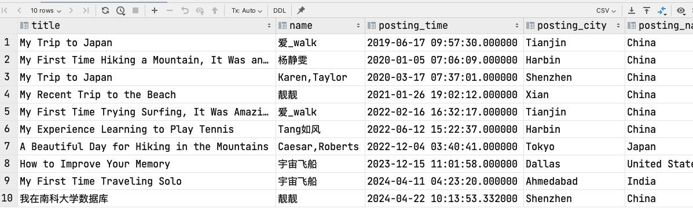
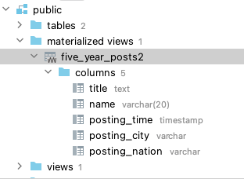
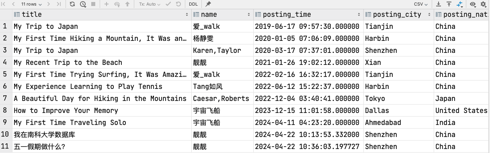
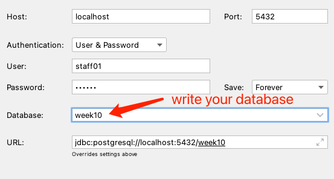
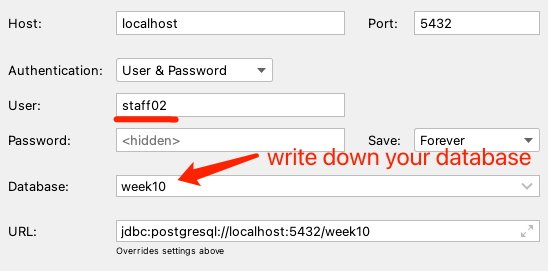
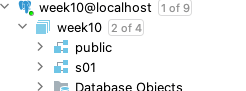

# Tutorial of View and User privilege

> Tutorial of view is designed by ZHU Yueming in April. 22th.2024, and refered to:
>
> 1. Official document of PostgreSQL
> 2. Char gpt
>
> Tutorial of User privilege is designed by ZHU Yueming in May 7th. 2023, and  refered to:
>
> 	1. Open Gause Tutorial of HUAWEI
>  	2. Official document of PostgreSQL
>  	3. Reference the idea of Stephane Faroult's

## Experimental Objective

- Understand how to create a view and how to use a view
- Understand the advantage of a view and add user access control of view.
- Understand the difference of ordinary user and super user
- Learn how to use and create a schema
- Understand the keywords of grant and revoke

## Part 1. View

### 1. Basic View

Prepare to this exercise, you need to import several data from the file ```view.sql```, and then try the sql query:

```sql
select title, name, posting_time, posting_city, posting_nation from posts
         join author a on posts.author_id = a.id
    where posting_time between CURRENT_DATE - INTERVAL '5 years' AND CURRENT_DATE;
```

The result will be:


This query is to combine two table author and posts, and filter the data in recent 5 years. To avoid typing the query repeatedly whenever needed, you can create a view that provides a name for the query. This allows you to reference the query as if it were a regular table.

```sql
create view five_year_posts as
select title, name, posting_time, posting_city, posting_nation
from posts
         join author a on posts.author_id = a.id
where posting_time > CURRENT_DATE - INTERVAL '5 years'
order by posting_time;

select * from five_year_posts;
```

**Change the value of table**

When the rows change in the tables where a view relies on,the result of a view will change as well. You can Try following query:

```sql
insert into posts (title, content, author_id, posting_time, posting_city, posting_nation) VALUES
    ('我在南科大学数据库','这是一个有趣的课程，老师们都很nice',7,current_timestamp,'Shenzhen','China');
```

The result will add a new row like:



**The benefit of view**

1. Complex SQL statements can be encapsulated into a view, simplifying the syntax of SQL queries.
2. Foreign keys in tables can be replaced with specific data, returning a complete entity.
3. Views can be assigned user permissions, restricting designated users to access only specific views.

### 2. Materialized View

> Following paragraphs description are borrowed from chat gpt.

Materialized views store precomputed data in a separate physical table, which can improve query performance but require additional storage space.

Materialized views and views (also known as virtual views) serve different purposes in database management:

1. **Views**:
   - **Virtual:** Views are virtual tables that do not store data themselves; they are essentially saved queries.
   - **Dynamic:** Each time a view is queried, the underlying query is executed to fetch the data.
   - **Real-time data:** Views display real-time data from the underlying tables.
   - **Storage:** Views do not consume additional storage as they do not store data separately.
   - **Performance:** Views can impact performance as the underlying query is executed each time the view is queried.
2. **Materialized Views**:
   - **Materialized:** Materialized views store the result set of the query in a separate physical table.
   - **Static:** The data in materialized views is static until the view is refreshed or updated.
   - **Precomputed data:** Materialized views store precomputed data, which can improve query performance for complex queries.
   - **Storage:** Materialized views consume additional storage space to store the data.
   - **Performance:** Materialized views can improve performance for read-heavy workloads as the data is precomputed and stored.

You can try to create a materialized view:

```sql
create materialized view five_year_posts2
as
select title, name, posting_time, posting_city, posting_nation
from posts
         join author a on posts.author_id = a.id
where posting_time > CURRENT_DATE - INTERVAL '5 years'
order by posting_time;
```

And then a new materialized view will be created, and you can find it in data grip:



Try to insert data into posts:

```sql
insert into posts (title, content, author_id, posting_time, posting_city, posting_nation) VALUES
    ('五一假期做什么？','很想出去玩，但还是写作业吧',7,current_timestamp,'Shenzhen','China');
```

After that, you can try, and you can get different result.

```sql
select * from five_year_posts;
select * from five_year_posts2;
```

Then you refresh the materialized view by:

```sql
refresh materialized view five_year_posts2;
```

Try ```select * from five_year_posts2;``` again, and you can find:




## Part 2. User privilege

Continue to the exercise view, do following steps:

### 1. Create ordinary user

- Step 1: using your ```superuser``` to create user
   Create ordinary user```staff01``` , ```staff02``` and set password as 123456

  ```sql
  create user staff01 password '123456';
  create user staff02 password '123456';
  ```

  And try

  ```sql
  select * from pg_user;
  ```

  

- Step 2: Using staff01 to try select, update, insert and delete query: 

  Create a new section in data grip using user ```staff01```

  

  The result is

  <font color='red'>[42501] ERROR: permission denied for table posts</font>

  ```sql
  select * from posts;
  
  insert into posts(title, content, author_id, posting_time, posting_city, posting_nation) values
   ('Exercise User privilege','It is interesting',current_timestamp,'Shenzhen','China');
  
  delete from posts where post_id=4;
  
  update posts set title='Learn SQL' where post_id = 4;
  ```

  

-  Step3: Using staff01 to try create query:

  It can be created successfully.

  ```sql
   create table test(
      id serial primary key ,
      name varchar unique
  );
  ```

  

- Step 4: Using staff02 to try select or drop query of the table test:

  Create a new section in data grip using user ```staff02```

  

  ```sql
  select * from test;
  ```

  <font color='red'>[42501] ERROR: permission denied for table test</font>

  ```sql
  drop table test;
  ```

  <font color='red'>[42501] ERROR: permission denied for table test</font>

From the operations above, we found that ordinary users do not have any permissions on tables created by others, but have full permissions on tables created by themselves

### 2. Manage User

- Step 1: Using superuser to add createrole privilege of ordinary user

  ```sql
  alter user staff01 createrole;
  ```

- Step 2: Using staff01 to create a ordinary user staff03

  ```sql
  create user staff03 password '123456';
  ```

  Then an ordinary user staff03 has been created

- Step 3: Using staff01 to create super user

  ```sql
  create user staff_super superuser password '123456';
  ```

  <font color='red'>[42501] ERROR: must be superuser to create superusers</font>

- Step 4: Using superuser to remove createrole privilege of ordinary user

  ```sql
  alter user staff01 nocreaterole;
  ```

- Step 5: Using superuser to lock an ordinary user

  ```sql
  alter user staff01 nologin;
  ```

- Step 6: Using staff01 to visit database.

  Click test connection again
   Then it shows:
   <font color='red'>[28000] FATAL: role "staff01" is not permitted to log in</font>

- Step 7: Using superuser to unlock an ordinary user

  ```sql
  alter user staff01 login;
  ```

- Step 8: Using superuser to drop an ordinary user

  ```sql
  drop user staff03 cascade;
  ```

- Step 9: query all users

  ```sql
  select * from pg_user;
  ```

### 3. Schema

- Step 1: Using superuser to create a schema, and give the schema a specific user

  ```sql
  create schema s01 authorization staff01;
  ```

  Then you can find a new schema s01 in database

  

- Step 2: Using ```staff01``` to create a table in schema ```s01```

  ```sql
   create table s01.test(
      id serial primary key ,
      name varchar unique
  );
  ```

  Users can only access database in their own schema. If a user need to access objects of other schemas, the owner of the schema should grant him the usage permission on the schema.

- Step 3: Using ```superuser``` to set the search path of ```staff01``` to its own schema and the public. Its own schema is the first search path, and public is the second search path.

  ```sql
  alter user staff01 set search_path to s01, public;
  ```

- Step 4: Using staff01 to show its own search path.

  Then test insert query, to find which table has been insert one row.

  ```sql
   show search_path ;
  insert into test(name) values ('haha');
  select * from test;
  ```

- Step 5: Show info in pg_user

  ```sql
  select usename, usecreatedb, usesuper,useconfig from pg_user;
  ```

- Step 6: Using ```superuser``` to grant select privilege on public schema to all ordinary user.

  The first public means the public schema.
  The second public means all users.

  ```sql
  grant select on all tables in schema public to public;
  ```

- Step 7: Using ```staff01``` to check select query on table posts in public schema:

  ```sql
  select * from posts;
  ```

- Step 8: Using superuser to revoke create privilege in public schema from all ordinary user. The first public means the public schema.
  The second public means all users.

  ```sql
  revoke create on schema public from public;
  ```

- Step 9: Using staff01 to check create query in public schema:

  ```sql
   create table public.my_table(
      id serial primary key ,
      name varchar unique
  );
  ```

  <font color='red'>[42501] ERROR: permission denied for schema public</font>

- Step 10: Using superuser to revoke connect privilege of staff01 from database week10

  ```sql
  revoke connect on database week10 from staff01 ;
  ```

- Step 11: find all schemas with its owner

  ```sql
  select catalog_name, schema_name, schema_owner
  from information_schema.schemata;
  ```

- Step 12: Using superuser to drop schema

  ```sql
  drop schema if exists s01 cascade;
  ```


## Exercises:

### Exercise 1: Only access on view

Revoke the privileges of creating, altering, dropping, and selecting all tables in the public schema for the user staff01, and grant permission only to select the five_year_post view.

The following queries will return an ERROR:

```sql
select * from posts;
create table test2(
    id serial primary key ,
    name varchar
);
drop table posts;
update posts set author_id=10 where post_id = 1;
```

The query below can execute.

```sql
select * from five_year_posts;
```

Please write down the queries how to set privilege in super user.


### Exercise 2: Multi-user collaborative management

In order to design a multi-user collaborative management database, we enable each user to have all permissions in their own schema and only read permission in the public schema. Requirements:

- Design a database managed by 3 users, one of which is superuser and the other two are ordinary users. The database contains a public schema and two common user-specific schemas.

  | Username | Schema Name | User Type     |
  | -------- | ----------- | ------------- |
  | Manager  | public      | superuser     |
  | Staff01  | s01         | ordinary user |
  | Staff02  | s02         | ordinary user |

- super user can do all premissions in the public schema.

- Ordinary users can do all permissions in their own schema, but only read permissions to public schemas, without any write permissions.

- The search path of ordinary users is their own schema, then public schema.

Please write down the queries how to set privilege in super user.