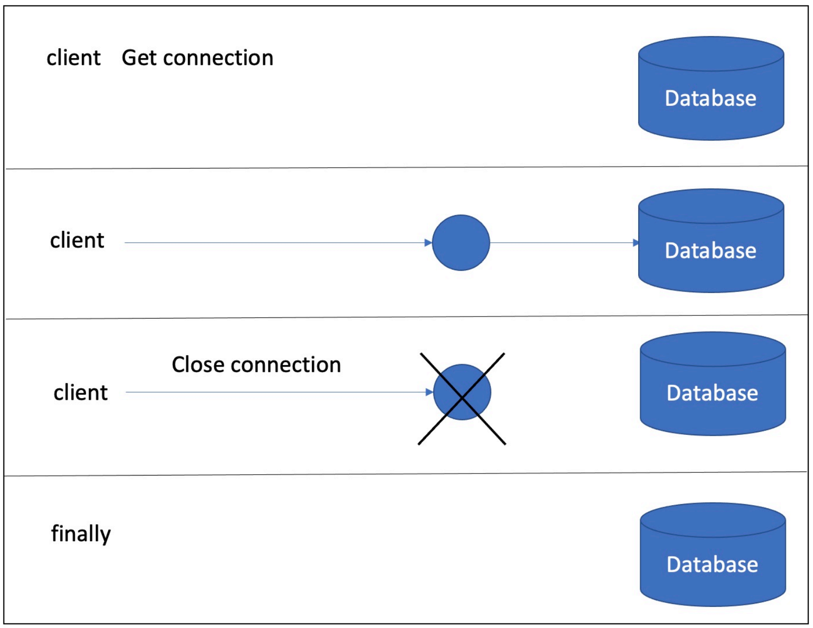
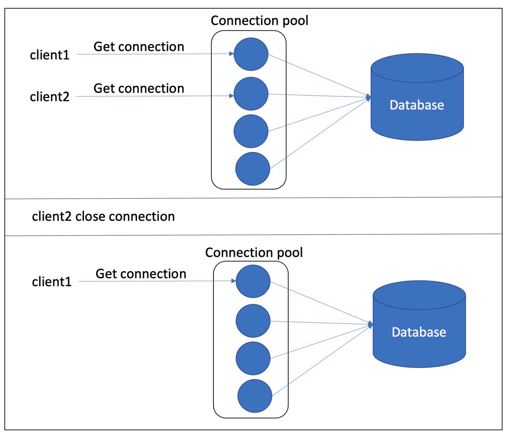
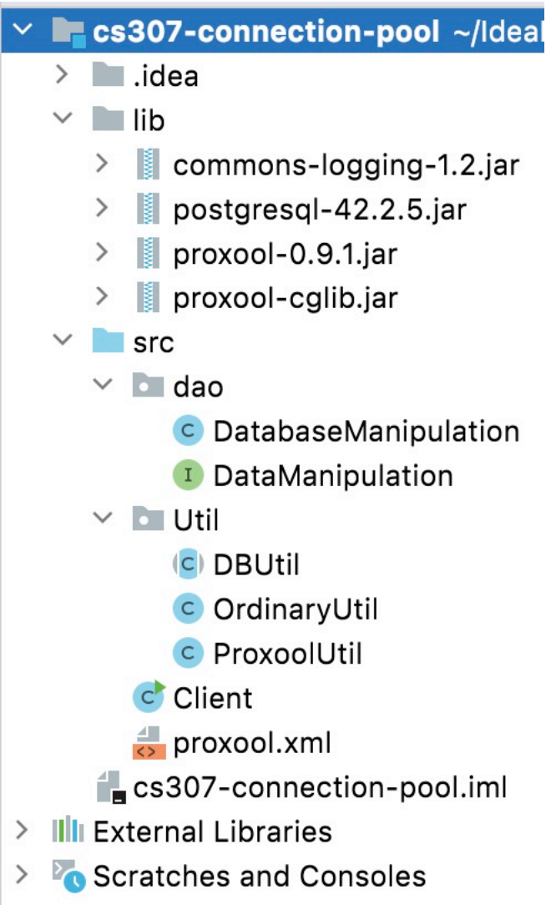
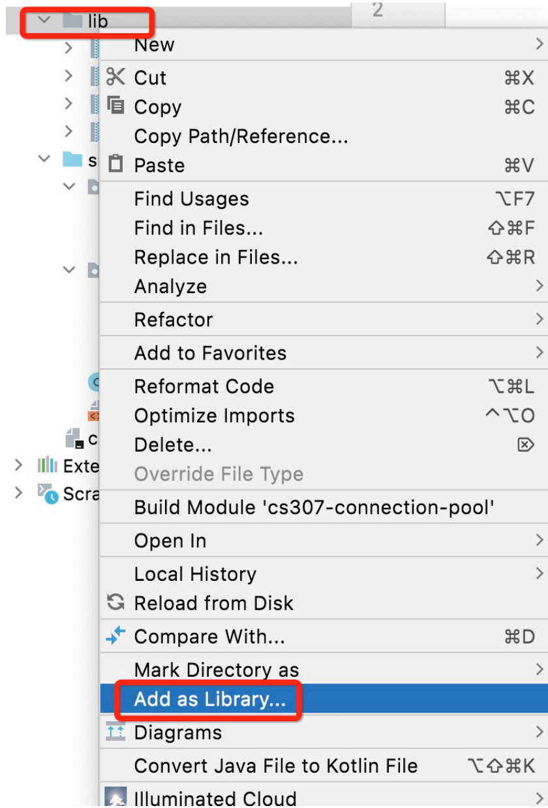

# Tutorial: Connection Pool

> Designed by ZHU Yueming in 2022 May. 8th

## **Experimental-Objective**

1. Understand the principle of Connection pool
2. Can refactor your code by using connection pool to visit DBMS

## What the connection pool helps?

Connection pool serves as a collection which contains several opening database connections that can be reused by database requests. In fact, establishing a database connection is a time-consuming operation, and the process will include network link, user authentication and so on.

**For ordinary process:**



**Using connection pool:**



## Build Your Project

### 1. Import data into database

load all data from ```shenzhen_metro.sql```  into database

### 2. In IntelliJ IDEA

- The structure of your project should be:

  

- Add lib folder to project library

  

- Configure your  ```protocol.xml```

  ```xml
     <proxool>
          <alias>postgres</alias>
          <driver-url>jdbc:postgresql://127.0.0.1:5432/cs307</driver-url>
          <driver-class>org.postgresql.Driver</driver-class>
          <driver-properties>
              <property name="user" value="checker"/>
              <property name="password" value="123456"/>
          </driver-properties>
          <minimum-connection-count>5</minimum-connection-count>
          <maximum-connection-count>10</maximum-connection-count>
  
      </proxool>
  ```

  Minimum connection count: Opening five database connections at the original time.

  Maximum connection count: The max count of opening database connections.

## How to Run it?

- Using Ordinary way:

  In ``Client.java``  

  In ```dbRequestArrived(int count)``` method

  Change statement:

  ```java
  DataManipulation dm = new DatabaseManipulation(OrdinaryUtil.getInstance());
  ```

- Using ProxoolUtil Connection Pool:

  In ``Client.java``  

  In ```dbRequestArrived(int count)``` method

  Change statement:

  ```java
  DataManipulation dm = new DatabaseManipulation(ProxoolUtil.getInstance());
  ```


