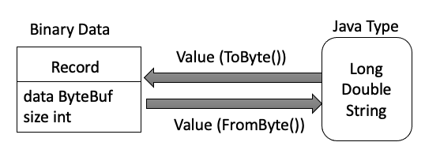

# Storage Design

> Desinged by ZHU Yueming in April 27th 2025.
>
> The project framework is provided by Zhang Ziyang


## 存储主要结构

### 1. ByteBuf 数据类型

```ByteBuf``` 是netty框架提供的二进制数据容器，即字节数据。在数据库存储引擎中，它被用来表示记录二进制形式、磁盘页面的原始数据等。其本质是一个动态的字节缓冲区，可以存储人意的二进制数据，例如：整数、字符串、序列化对象等。

在项目中的应用如下：

- **Record.data**: 以二进制的方式存储一条数据库记录。

  如果说，二进制数据的容器是```Record```,管理Java数据类型的容器是```Value```， 那么我们需要一个二进制数据与Java数据类型相互转化的媒介，这里便用到了```Value``` 类中的 ToByte() 与 FromByte() 方法，如图所示。

  

- **Page.data**: 磁盘页面(Page)的原始字节数据。

- **RecordFileHeader.header**:  文件头信息记录。

  整体RecordFileHeader中的header字段使用二进制记录内容，具体结构如下：

  

- **RecordPageHeader.data**: 页面头信息记录。

  整体RecordPageHeader中的data字段使用二进制记录内容，具体结构如下：

  

### 2. BitMap 位图

BitMap 的核心功能即**空间高效管理**， 每一个bit位代表记录一个槽位的状态。

- 1代表槽位被占用，即存在有效记录。
- 0代表槽位空闲，即无记录，可插入新纪录。

关键方法介绍：

```java
// 初始化位图（全部置0）
BitMap.init(bitmap); 

// 设置第5个槽位为占用
BitMap.set(bitmap, 5);

// 检查第3个槽位是否占用
boolean occupied = BitMap.isSet(bitmap, 3);

// 找到下一个空闲槽位
int freeSlot = BitMap.firstBit(false, bitmap, recordsPerPage);
```


### 3. File 与 Page 

#### 3.1 结构介绍：

在项目结构中，每一个表都存储在一个二进制文件中，具体目录可见 **CS307-DB** -> 表名的文件夹中的data文件。 而一个data文件也会分别存储在多个磁盘页面中。其中首页面为头页面，接下来的页面为数据页面。数据页面里主要包含3个部分：

- 页面头。（前8字节）
- Bitmap 位图。（记录插槽的使用情况）
- 插槽(如果插槽里有数据，则存放一个真正的Record)

具体的File 与Page的结构图如下：


这里需要注意的是，PageID并没有存放在页面中，而是通过内存管理起来。通过一个文件内的偏移量标记页号。可见 ```DEFAULT_PAGE_SIZE=4096```

```java
public int getPageID() {
    return position.offset / DEFAULT_PAGE_SIZE;
}
```

PageID 是这样获取的：

- 偏移量0  ➔  PageID 0
- 偏移量4096 ➔  PageID 1
- 偏移量8192 ➔  PageID 2

#### RID：

RID是在java内存中的对象，每个对象记录了一个数据页编号，一个插槽编号，用于锁定数据。

```java
public class RID {
    public int pageNum;
    public int slotNum;
    }
```

总结一下：

- 真正的有效数据页是从PageID 1开始。
- 真正的有效插槽是从SlotNum 0 开始。

#### 3.2 调用方法：

- 每个文件有多少个页面？

  ```java
  fileHandle.getFileHeader().getNumberOfPages();
  ```

- 每个数据页面中有多少条记录？

  ```
  fileHandle.getFileHeader().getNumberOfRecordsPrePage();
  ```

- 如何判断当前插槽有数据？

  ```
  BitMap.isSet(pageHandle.bitmap, currentSlotNum))
  ```

- 如何获取当前插槽数据的Record类型？

  ```
  fileHandle.GetRecord(rid);
  ```


#### 练习

写一段代码，遍历File里的每一个page，以及page里每一个插槽，来判断哪些插槽中有数据。在这个遍历过程中，可以使用BitMap辅助。


