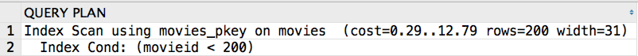

# Tutorial: Index

>Sample Queries of Exercise
>
>Designed by ZHU Yueming in 2019
>
>Modified by ZHU Yueming in May. 16th 2022. Update the explanation of index scan, bitmap index scan and hash join.

## How to create Index

This part only for you to exercise, because of the data in flight is large.

1. Import data from those three files:

   ```
   cs307_public_aircrafts.sql
   cs307_public_airlines.sql
   cs307_public_flights.sql
   ```

2. Create Index:

   ```sql
   select * from flights where duration = 505;
   ```

   Result:

    91 rows retrieved starting from 1 in 923 ms (execution: 68 ms, fetching: 855 ms)

   ```sql
   create index duration_index on flights(duration);
   ```

   After creating index, do the same query and the result would be:

   91 rows retrieved starting from 1 in 73 ms (execution: 32 ms, fetching: 41 ms)


## EXPLAIN
### Part 1. Basic Search
#### Sequence Scan

Scan the whole table:

```
explain select * from movies;
```
Result:


Total evaluation time cost = seq_page_cost + cpu_tuple_cost.<br>
The time cost in seq_page is about 1.0, while time cost in cpu_tuple is about 0.01.
Suppose the data from 9538 rows in table movies are distributed in 74 disk page, and the total time cost would be **74 * 1.0 + 9538 * 0.01 = 169.38**

- Adding where condition

```
explain select * from movies where movieid<6000;
```
Result:


#### Index Scan:

First scan the index, and then find the pointer of the record that meets the requirements from the index, and then locate the specific page in the table to fetch.

```
explain select * from movies where movieid<200;
```
Result:


### Part 2. Bitmap
#### Bitmap Index scan

Scan the index of pages, and then build bitmap that meets the requirements in **cash**, do not need locate the specific page of corresponding data.

#### Bitmap Heap scan

It is the parent node of Bitmap index scan, so that it is usually executed after several different Bitmap Index Scans. Ather that it does BitmapAnd or BitmapOr of bitmap before fetching the actual data.

#### Example:

Suppose if a table has index of b+ tree in two columns x and y, then we want to find x = 1 and y = 2 of the table. 

In this case, the process scans **index** pages of x and y, and builds two bitmaps in cash, the one is for the condition x = 1, the other is for the condition y = 2. After that process the ```bitmap heap scan``` with ```BitmapAnd``` operation, and then generate a final bitmap.

```txt
x=1:      00000000 01110001 00111001 00000000 00000000 01110111
y=2:      00000000 00010001 10000001 00001011 00000000 00000000
BitmapAnd:00000000 00010001 00000001 00000000 00000000 00000000
```

Explain:

```
explain select * from flights where duration = 105;
```
Result:


### Part 3. Join
####  Nest Loop

```sql
explain select *
        from movies m
          join
          countries c2 on m.country = c2.country_code
        where c2.country_code = 'cn';
```
Result:
    

#### Hash Join

If there are two tables the one is smaller and the other is larger. Firstly, scan the smaller one by its specific scan method and build the hash table, then scan the larger one by its specific method to match the hash table. Finally do hash join according to the condition.

The whole process:


The hash join:


Example:

```sql
explain select *
        from movies m
          join credits c
            on m.movieid = c.movieid
        where c.credited_as = 'D' and m.movieid < 200;
```
Result:
 

See more in this [link](https://www.postgresql.org/docs/13/using-explain.html)

### Part 4. multi-key indexes

Step 1

```sql
create table my_movies
  as
    select *
   from movies;
```
Step 2

```sql
create index movies_multi_index on my_movies(movieid,year_released, runtime);
```
Step 3 Compare with following queries

```
explain select * from my_movies where movieid=20;
explain select * from my_movies where movieid<100 and year_released=2000;
explain select * from my_movies where year_released=2000;
explain select * from my_movies where runtime=200;
```

### Part 5. Create index on function
Step 1

```sql
create index movies_title_index on my_movies(title);
```
Step 2 Compare following two queries, whether index is effected.

```sql
explain select * from my_movies where title = 'Armaan';
explain select * from my_movies where upper(title) = 'ARMAAN';
```
Step 3 Create index on upper() function

```sql
create index movies_upper_title_index on my_movies(upper(title));
```

Step 4 whether index is effected in follow query

```sql
explain select * from my_movies where upper(title) = 'ARMAAN';
```