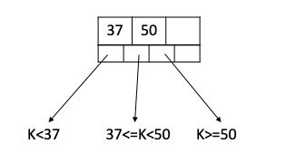
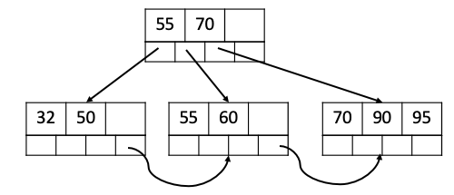
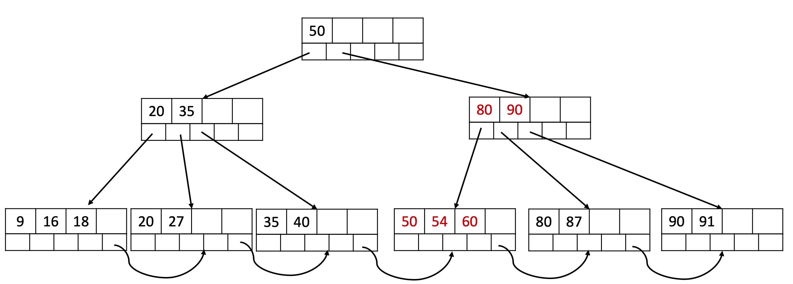

# Tutorial: B+ Tree

>Designed by ZHU Yueming in May. 2024
>
>Reference:
>
>https://www.geeksforgeeks.org/deletion-in-b-tree/
>
>https://blog.csdn.net/wyll19980812/article/details/106069433
>
>彭智勇 彭煜玮. 《PostgreSQL 数据库内核分析》, 机械工业出版社 2012.

## Introduction

The leaf nodes on a B+ tree store keys and its corresponding addresses, while the upper levels of the leaf nodes (Root Node and Internal Nodes) are used as indexes. The **count of keys** in B+ tree of M degree is defined as follows.

- **Root Node**: $1$ to $ M-1 $
- **Internal Nodes**：$⌈M/2⌉-1$ to $M-1$  
- **Leaf Nodes**：$⌈M/2⌉-1$ to  $M-1$

**If the degree of M is 4:**

Root or Internal Nodes:



Leaf Nodes: 

*It is an example of **Clustered Index***


The whole B+ tree index can be:


## Insert

### General way

When do insertion operation of B+ tree, firstly located the leaf node where the current data should be inserted. It has three possible scenarios.：

1. If the count of key in Leaf Node **< M-1**, we can insert directly.

2. If the count of key in Leaf Node **= M-1**,  we should split the Leaf Node to two Leaf Node, and then insert the first key of the Right Leaf Node into the super Node.

   - Left Leaf Node contains the index:  $1$ ~  $⌊M/2⌋$
   - Right Leaf Node contains the index:  $⌊M/2⌋+1$ ~ $M$

3. If the count of key in Leaf Node **= M-1**,  we should split the Leaf Node, and then if the count in super Node **= M**, we should also split the super Node to two Interval Nodes.

   - Leaf Interval Node contains the index of super Node: $1$ ~  $⌊M/2⌋$
   - Right Interval Node contains the index of super Node: $⌊M/2⌋+2$ ~ $M$
   - Insert the $⌊M/2⌋+1$  th key into the super level of the current super Node.

   In this way, if the root node is split, then the height of the B+ tree increases by 1.

### Example:

A B+ tree with a degree of 4 as an example to decribe the insertion process steps by steps:

The **count of keys** in each Internal Node and Leaf Node should be 1-3.

- Firstly insert 32, 50, 70 , 90

  

  Then we can find the count of key in Leaf Node equals to 4, we should split it.

  

- Then insert 60, 95

  

- Then insert 55

  

  We will split the node 32, 50, 55, 60。 The left node contains 32, 50, the right node contains 55, 60， and insert 55 to the super node.

  

- Then insert 85.

  In similar way, after insert 85, the tree will be:

  

- Then insert 40, 54.

  

  In this case, we need split the node (32, 40, 50, 54) and then insert the 50 into super node.

  

  However, the length of super node equals to 4. We also split the super node. And the height of the tree will be increased by 1.

  

## Remove

### General way

When do insertion operation of B+ tree, firstly located the leaf node where the current data should be deleted. It has five possible scenarios below：

1. If the count of key in Leaf Node **>$⌈M/2⌉-1$** , we can delete directly. 
   - If the delete value is the first key of current node, we need update the cooresponding key in super node to its new first key.
2. If the count of key in Leaf Node = **$⌈M/2⌉-1$**, and the count of key in its brother node is  **>$⌈M/2⌉-1$**,   we should borrow a key from its brother Node. Then change the cooresponding key in super node.
3. If the count of key in Leaf Node = **$⌈M/2⌉-1$**, and its brothers don't have enough keys , we need to merge two Leaf node into one. And then, the count of key in super node should decreased by 1.
4. Continue to scenarios 3, relocated the current node to its super node.  If the count of key in current node **< $⌈M/2⌉-1$**, and the count of key in brother node  in its brother node is **>$⌈M/2⌉-1$**, then:
   - Move down the key in super node.
   - Move up the key in its brother node.
5. Continue to scenarios 4, if the brother node don't have enough keys, we need to merge two node into one. Continue it to the root node, if the count of the root node is 0 after merge, the height of B+ tree will be decreased by 1.

### Example 1

A B+ tree with a degree of 5 as an example to decribe the deletion process steps by steps:

The **count of keys** in each Internal Node and Leaf Node should be 2-4.

- Original B+ tree:

  

- Remove 44

  Remove 44 directly.

  

- Remove 68

  After remove 68, the Leaf Node only has one key 60. In this case, we need borrow a key 57 from brother Node.

  

  After that, the smallest key in the Leaf Node is 57, and we need change the cooresponding key to 57 in super node.

  

- Remove 57.

  In similar way, after remove 57, the tree will be:

  

- Remove 75

  After remove 75, the Leaf Node only has one key 60. However brothers don't have enough keys to borrow.

  

  In this case, we need merge two Nodes, and change the cooresponding key in super node.

  

- Remove 18, 16.

  After remove 18, 16, the Leaf Node only has one key 9. However brothers don't have enough keys to borrow.

  

  In this case, we need merge two Nodes, and change the cooresponding key in super node like 35. Relocated the current node to its super node, and find the count of keys in **relocated current node** only has one key 35 which is smaller than 2.

  

  Firstly, the  relocated current node can borrow nodes from its brother, but there is no enough keys in the brother node. , we need to merge two  node into one, and the height of B+ tree will be decreased by 1.
  
  

### Example 2:

Original B+ tree:


- Remove 35:

  After remove 35, the Leaf Node only has one key 27. However brothers don't have enough keys to borrow. We need merge two node, and move down the node 27 in super node

  

  Then relocated the current node to super node (18), and the count of key in brother of relocated current node is >$⌈M/2⌉-1$. After that we need:

  - Move down the 50 in super node.
  - Move up the 60 in its brother node.

  

## Code design:

> Refer to the  https://www.geeksforgeeks.org/deletion-in-b-tree/

### Java

```java
class Node {
    List<Integer> keys;
    List<Node> values;
    boolean leaf;
    Node next;

    public Node(boolean leaf) {
        this.keys = new ArrayList<>();
        this.values = new ArrayList<>();
        this.leaf = leaf;
        this.next = null;
    }
}
public class BPlusTree {
    private Node root;
    private int degree;

    public BPlusTree(int degree) {
        this.root = new Node(true);
        this.degree = degree;
    }
}
```

### Python

```python
# Python Implementation
class Node:
        # Creating structure of tree
    def __init__(self, leaf = False):
        self.keys = []
        self.values = []
        self.leaf = leaf
        self.next = None

# B + Tree

class BPlusTree:
    def __init__(self, degree):
        self.root = Node(leaf = True)
        self.degree = degree
```

### C++

```c++
class Node {
public:
    std::vector<int> keys;
    std::vector<Node*> values;
    bool leaf;
    Node* next;

    Node(bool isLeaf) : leaf(isLeaf), next(nullptr) {}
};

class BPlusTree {
private:
    Node* root;
    int degree;
    }
```

