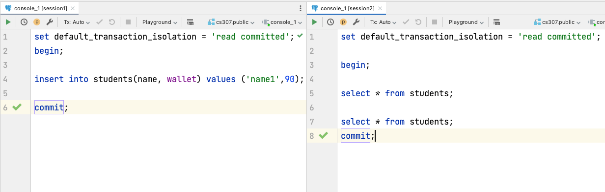

# Tutorial: Transaction (PostgreSQL version)

> Designer : ZHU Yueming in 2020.  
>
> Finally improved in 2023. May 17th.
>
> Descriptions words of basic concepts of ACID in this tutorial are borrowed from lecture notes of CHENG Jingde

### Experimental Objective

- Learn the properties of ACID of transaction. 
- Learn three different isolation levels of transaction.

## Preparing Your Lab 

- Create two consoles in datagrip named Session1 and Session2
- Execute following queries in either Session1 or Session2.

```sql
create table students(    
	  id serial primary key ,
    name varchar(30) not null,
    wallet int,
    unique (name) 
    );
```


## ACID

### 1. Atomicity

- The “all or nothing” property. 
- A transaction is an indivisible unit that is either performed in its entirety or is not performed at all. 
- It is the responsibility of the recovery subsystem of the DBMS to ensure atomicity.

```sql
begin; 
insert into students (name, wallet) values ('name1',90); 
insert into students(name,wallet) values('name2',85); 
commit;
```

We only can execute all statements or null statements in one transaction.

### 2. Consistency

- A transaction must transform the database from one consistent state to another consistent state.
- It is the responsibility of both the DBMS and the application developers to ensure consistency.

```sql
begin; 
update students set wallet=wallet-4 where name='name1'; 
update students set wallet=wallet+4 where name='name2'; 
commit;
```

If we want to give 4 money to the second student from the first student, we could not only minus 4 money from the first student without adding 4 money to the second in one transaction. 

### 3. Durability

- The effects of a successfully completed (committed) transaction are permanently recorded in the database and must not be lost because of a subsequent failure. 
- It is the responsibility of the recovery subsystem to ensure durability.

```sql
begin ; 
truncate students;
commit; 
rollback ; 
select * from students;
```

In a transaction, if we remove all students, and then we commit changes. After that, we could not find any record in students table, even though we execute rollback. 

### 4. Isolation

- Transactions execute independently of one another. 
- The partial effects of incomplete transactions should not be visible to other transactions. 
- It is the responsibility of the concurrency control subsystem to ensure isolation. More specific examples of isolation properties could be shown in following description.

## Basic commands of transaction

- Change auto commit off (by command line)

  ```
  \set AUTOCOMMIT off
  ```

- show auto commit (by command line)

  ```
  \set
  ```

- show current transaction isolation:

  ```sql
  show transaction_isolation;
  ```

- set transaction isolation level in current transaction:

  ```sql
  set transaction isolation level [isolation level];
  ```

- set default transaction isolation level:

  ```sql
  set default_transaction_isolation = '[isolation level]';
  ```


## Isolation Level

As show in the table below, the isolation level of different reading results is only suitable for postgreSQL. In fact, there are only three distinct isolation levels in postgreSQL, which correspond to the levels read committed, repeatable read and serializable read. Read uncommitted do the same work as read committed in postgreSQL, which is different from Mysql or other DBMS.

| ISOLATION LEVEL  | Dirty Read | Nonrepeatable Read | Phantom Read |
| ---------------- | ---------- | ------------------ | ------------ |
| read uncommitted | N          | Y                  | Y            |
| read committed   | N          | Y                  | Y            |
| repeatable read  | N          | N                  | N            |
| serializable     | N          | N                  | N            |

#### Before you start

You can create two sessions servers as two transactions that to accomplish following cases:

Both of two sessions visit the same database.



### 1. Read-uncommitted 

One transaction can read the result of query executed by another uncommitted transaction, but it is not supported by postgreSQL. 

### 2. Read committed 

In this isolation level, it can read the data successfully commited to the database at any time.

Nonrepeatable read occurs in step4 and step6.

| Step | Session1                                                | Session2                                              |
| ---- | ------------------------------------------------------- | ----------------------------------------------------- |
| 1    | set default_transaction_isolation = 'read committed';   | set default_transaction_isolation = 'read committed'; |
| 2    | begin;                                                  | begin;                                                |
| 3    | insert into students(name, wallet) values ('name1',90); |                                                       |
| 4    |                                                         | select * from students;                               |
| 5    | commit;                                                 |                                                       |
| 6    |                                                         | select * from students;                               |
| 7    |                                                         | commit;                                               |

Phantom Read occurs in step 6. However, postgreSQL has avoided phantom reading. Following case can be reflected in Mysql database. 

| Step | Session1                                              | Session2                                                |
| ---- | ----------------------------------------------------- | ------------------------------------------------------- |
| 1    | set default_transaction_isolation = 'read committed'; | set default_transaction_isolation = 'read committed';   |
| 2    | begin;                                                | begin;                                                  |
| 3    |                                                       | insert into students(name, wallet) values ('name2',80); |
| 4    |                                                       | commit;                                                 |
| 5    | update students set wallet=100 where wallet<100;      |                                                         |
| 6    | select * from students;                               |                                                         |
| 7    | commit;                                               |                                                         |
| 8    | select * from students;                               |                                                         |

### 3. Repeatable read

In this isolation level, it is can only read the state of the database at the beginning of the transaction.

Nonrepeatable Read and Phantom Read don't occur in step 5 and step 7 respectively. 
Only when committed in session 2, the  changes in other session can be read.

| Step | Session1                                                | Session2                                               |
| ---- | ------------------------------------------------------- | ------------------------------------------------------ |
| 1    | set default_transaction_isolation = 'repeatable read';  | set default_transaction_isolation = 'repeatable read'; |
| 2    | begin;                                                  | begin;                                                 |
| 3    | insert into students(name, wallet) values ('name2',55); |                                                        |
| 4    | commit;                                                 |                                                        |
| 5    |                                                         | select * from students;                                |
| 6    |                                                         | update students set wallet=100 where wallet<100;       |
| 7    |                                                         | select * from students;                                |
| 8    |                                                         | commit;                                                |
| 9    |                                                         | select * from students;                                |

### 4. Serializable

Read/write should be serializable executed in different transactions.
An error will occurred in step 8: 

<font color='RED'>[40001] ERROR: could not serialize access due to read/write dependencies among transactions Detail: Reason code: Canceled on identification as a pivot, during write. Hint: The transaction might succeed if retried.</font>

| Step | Session1                                                | Session2                                                |
| ---- | ------------------------------------------------------- | ------------------------------------------------------- |
| 1    | set default_transaction_isolation = 'serializable';     | set default_transaction_isolation = 'serializable';     |
| 2    | begin;                                                  | begin;                                                  |
| 3    | insert into students(name, wallet) values ('name3',80); |                                                         |
| 4    | select * from students;                                 |                                                         |
| 5    |                                                         | insert into students(name, wallet) values ('name4',80); |
| 6    | commit;                                                 |                                                         |
| 7    |                                                         | select * from students;                                 |
| 8    |                                                         | commit;                                                 |

Or

<font color='RED'>[40001] ERROR: could not serialize access due to read/write dependencies among transactions Detail: Reason code: Canceled on identification as a pivot, during write. Hint: The transaction might succeed if retried.</font>

| Step | Session1                                                | Session2                                                |
| ---- | ------------------------------------------------------- | ------------------------------------------------------- |
| 1    | set default_transaction_isolation = 'serializable';     | set default_transaction_isolation = 'serializable';     |
| 2    | begin;                                                  |                                                         |
| 3    | insert into students(name, wallet) values ('name3',80); |                                                         |
| 4    | select * from students;                                 |                                                         |
| 5    |                                                         | begin;                                                  |
| 6    | commit;                                                 |                                                         |
| 7    |                                                         | insert into students(name, wallet) values ('name4',80); |
| 8    |                                                         | select * from students;                                 |
| 9    |                                                         | commit;                                                 |

In serializable ISOLATION LEVEL，if one transaction begins before another transaction's commit, during the period from the beginning of the first transaction to the end of the last transaction, there can be no more than one transaction doing both read and write operations. However, it is no problem for one transaction to do both read and write operations, and other transaction to only do read or write operations.

Official documents: [link](https://www.postgresql.org/docs/9.5/transaction-iso.html)


