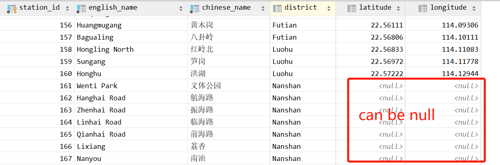
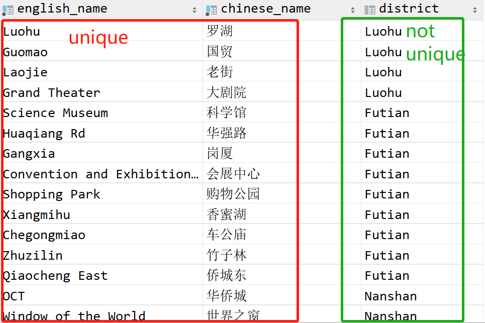
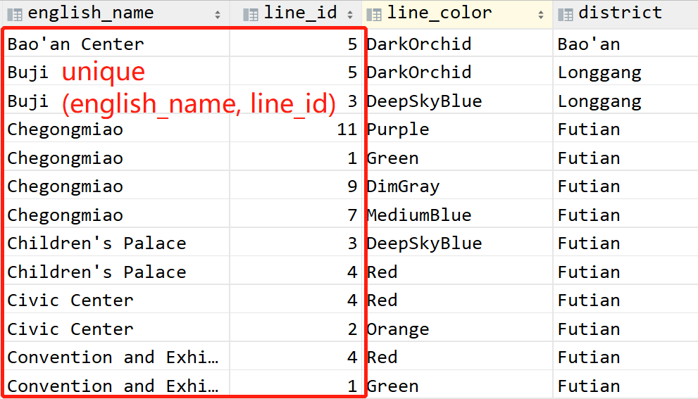
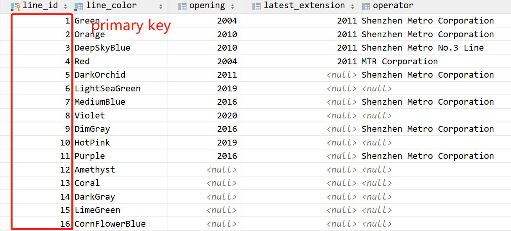
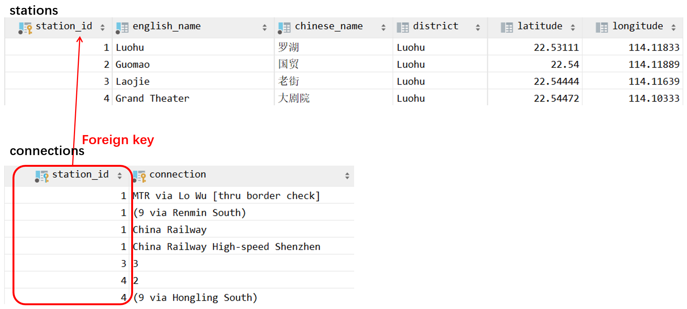
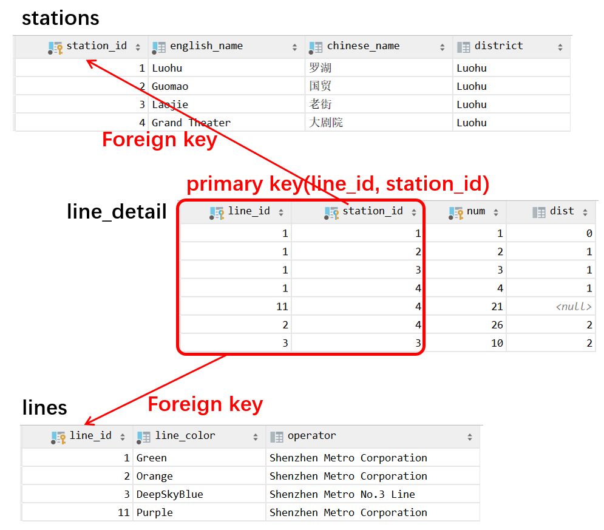

# Tutorial:  Constraints and DDL Query

> Designed by ZHU Yueming. A small part of descriptions of basic concepts in this tutorial are borrowed from the Stephane Faroult's Slide and Wikipedia. 
>
> Modify it to simple database design by ZHU Yueming  in 2022.1.10 and 2022.1.22

## Experimental Objective

- Understand basic constraints in database design
- Understand basic DDL (Data Definition Language) language

## Part 1. Constraints

Constraints are declarative rules that the DBMS apply to ensure the integrity of data. DBMS will check constraints every time new data is added, changed or deleted, to prevent any inconsistency. Any operation that violates a constraint fails and returns an error. 

### 1. NOT NULL

If you want one column cannot be null, you can indicate the column by ```not null```.

Sample DDL language.

```sql
create table if not exists stations
(
	station_id integer not null
		constraint stations_pkey
			primary key,
	english_name varchar(80) not null
		constraint stations_uq_1
			unique,
	chinese_name varchar(10) not null
		constraint stations_uq_2
			unique,
	district varchar(20),
	latitude double precision,
	longitude double precision
);
```

Sample graph:



### 2. UNIQUE

Each value in the specified column(s) is unique.

- Unique for one column

  Sample DDL language.

  ```SQL
  create table if not exists stations
  (
  	station_id integer not null
  		constraint stations_pkey
  			primary key,
  	english_name varchar(80) not null
  		constraint stations_uq_1
  			unique,
  	chinese_name varchar(10) not null
  		constraint stations_uq_2
  			unique,
  	district varchar(20),
  	latitude double precision,
  	longitude double precision
  );
  ```

  Sample graph:

  

- Unique for multiple columns

  Sample DDL Language

  ```sql
  create table test_unique (
      id serial primary key,
      english_name varchar(80) not null,
      line_id integer not null,
      line_color varchar(20) not null,
      district varchar(20),
      constraint uq unique (english_name, line_id)
  );
  ```

  Sample graph:

  

### 3. PRIMARY KEY

Primary key  specifies the main key for the table, which is: 

- Mandatory (the additional NOT NULL doesn't hurt but is redundant)
- Unique (no duplicates allowed in the column)   

Sample DDL Language

```sql
create table if not exists lines
(
	line_id integer not null
			primary key,
	line_color varchar(20) not null
			unique,
	opening integer,
	latest_extension integer,
	operator varchar(30)
);
```

Sample graph:



### 4. FOREIGN KEY

Foreign key indicates that the column must reference a key (Only primary keys and columns declared as UNIQUE) of another table.

- Constraints are used to prevent actions that break the connection between tables
- Constraints also prevent illegal data from being inserted into the column.

Sample DDL Language:  we add a foreign key constraint ```station_id```  in table ```connections``` , which references the primary key ```station_id``` in table ```stations```

```sql
create table connections
(
    station_id integer      not null
        constraint connections_fk
            references stations(station_id),
    connection varchar(100) not null,
    constraint connections_pk
        primary key (station_id, connection)
);
```

Sample graph:



In this case, we cannot insert any data in connections if the inserted station_id is not appeared in the column station_id in stations table because of the foreign key. For example

```sql
insert into connections (station_id, connection) values (10086,'CSE');
```

The result would be:

```
[23503] ERROR: insert or update on table "connections" violates foreign key constraint "connections_fk" 详细：Key (station_id)=(10086) is not present in table "stations".
```

Another sample graph below represents one table can have multiple foreign keys.



## Part 2. Sample data definition language （DDL）

In the database cs307 you have been created last week, do following exercises step by step.

```sql
create database cs307 encoding='utf8';
```


### 1. Create Table Example

- First table represents ticket.

  ```sql
  create table if not exists ticket
  (
      id           serial primary key,
      train_number varchar(10) not null unique,
      depart_city  varchar     not null,
      arrival_city varchar     not null,
      depart_time  time,
      price        numeric check (price > 0)
  );
  ```

  

- Second table represents the customer.

  ```sql
  create table customer
  (
      id           serial,
      username     varchar(10) not null unique,
      password     varchar,
      phone_number varchar(11)
  );
  ```

  

- The relationship between ticket and customer is many-to-many, in this case it is usually create a relation table if we want to make a connection of those two tables. In the relation table, usually contains a primary key id, and two foreign key id related to those two tables responstively.

  ```sql
  create table booking_record
  (
      id          serial primary key,
      ticket_id   integer,
      customer_id     integer,
      date        date not null,
      depart_city varchar,
      arrive_city varchar,
      constraint fk_ticket foreign key (ticket_id) references ticket(id)
  );
  ```

  

### 2. Alter Table Example

#### 1) add not null constraint

General Syntax:

```
ALTER TABLE [ IF EXISTS ] [ ONLY ] table_name
    ALTER [ COLUMN ] column_name { SET | DROP } NOT NULL
```

Example:

```sql
alter table customer alter password set not null;
```

#### 2) add primary key

General Syntax:

```
ALTER TABLE table_name
ADD CONSTRAINT MyPrimaryKey PRIMARY KEY (column1, column2...);
```

Example:

```sql
alter table customer add constraint pk_customer_id primary key (id);
```

#### 3) add foreign key

General Syntax:

```
ALTER TABLE table_name
ADD CONSTRAINT ForeignKey FOREIGN KEY (column) REFERENCES table2 (column);
```

Example:

```sql
alter table booking_record add constraint fk_customer foreign key (customer_id) references customer(id);
```

#### 4) change data type of column

General Syntax:

```
ALTER TABLE table_name ALTER COLUMN column_name TYPE datatype;
```

Example:

```sql
alter table customer alter column phone_number type varchar;
```

#### 5) add one column

General Syntax:

```
ALTER TABLE table_name ADD COLUMN column_name TYPE datatype;
```

Example:

```sql
alter table ticket add column seat_type varchar(2);
```

#### 6) drop one column

General Syntax:

```
ALTER TABLE table_name DROP COLUMN column_name;
```

Example:

```sql
alter table booking_record drop column depart_city;
alter table booking_record drop column arrive_city;
```

*Analysis from the database design, why those two columns need drop?*

*```depart_city``` and ```arrive_city``` are duplicate column, because the relation table do not need store the columns that declared in its referenced table.*

*Suppose insert a row in those three table respectively:*

```sql
insert into ticket(train_number, depart_city, arrival_city, depart_time, price)
values ('G12345', 'SHENZHEN', 'GUANGZHOU', '153000', 100);
insert into customer (username, password, phone_number)
values ('A', '123456', 12345678901);
insert into booking_record(ticket_id, customer_id, date, depart_city, arrive_city)
VALUES (1, 1, '2022/2/22', 'BEIJING', 'SHANGHAI');
```

*If we do following query, we would find two different arrive city and depart city.*

```sql
select t.train_number,
       t.depart_city,
       t.arrival_city,
       t.price,
       br.depart_city,
       br.arrive_city,
       br.date
from booking_record br
         join ticket t
              on br.ticket_id = t.id;
```


#### 7) drop constraints

General Syntax:

```
ALTER TABLE table_name DROP CONSTRAINT constraint_name;
```

Example:

```sql
alter table booking_record drop constraint unique_columns;
alter table booking_record add constraint unique_columns unique (customer_id,ticket_id,date);
```


#### 8) rename

General Syntax:

```
ALTER TABLE table_name RENAME TO new_name;
ALTER TABLE table_name RENAME COLUMN column_name TO new_column
```

Example:

```sql
alter table booking_record rename column date to booking_date;
```

#### 9). add check constraints

General Syntax:

```
ALTER TABLE table_name ADD CONSTRAINT constraint_name CHECK (CONDITION);
```

Example:

```sql
alter table customer add constraint check_phone check ( length(phone_number)>=11 );
```


### 3. Drop Table Example

- Firstly, you drop the table, which has been referenced by an foreign key of other table. Try the query below

  ```sql
  drop table customer;
  ```

  The result would be:

  ```
  [2BP01] 错误: 无法删除 表 customer 因为有其它对象倚赖它 详细：在表 booking_record上的约束fk_customer 倚赖于 表 customer 建议：使用 DROP .. CASCADE 把倚赖对象一并删除.
  ```

- Solution 1.  Drop table customer and all its foreign key constraints in other  tables.

  ```sql
  drop table customer cascade;
  ```

- Solution 2. Drop the all other tables which have foreign key constraint that related to the current table first, and then drop current table.

  ```sql
  drop table booking_record;
  drop table customer;
  ```


### 4. Check the constraints:

Use the query below to check the constraints:

```sql
select tc.constraint_name, tc.constraint_type, tc.table_name
from information_schema.table_constraints tc
where tc.constraint_schema="current_schema"();
```


## Part 3. Exercise

Design a simple database which contains four tables as follows:

- student  (name, student_number(unique), department, gender) 
- department (name, location, website) 
- course (name, course_number, department, credit)
- course_selected(student_id, course_id, semester, course_status)

Other requirements describe as follows: The relationship between Student and Course is many-to-many. The relationship between Course and Department is many-to-one. The relationship between Student and Department is many-to-one.

Hints: How to represent many-to-one relationship between two tables?  You can reference the following queries:

Those queries represents the relationship between department and student, and we can find that one student has one department while one department contains many student. In this case, we add a foreign key on student, which is an id of the primary column in department table.

```sql
create table department(
    id serial primary key ,
    name varchar not null,
    location varchar,
    website varchar
);
```

```sql
create table student(
    id serial primary key,
    name varchar not null,
    student_number varchar unique not null,
    department_id integer,
    gender varchar(2) not null,
    constraint fk_stu_department foreign key (department_id) references department(id)
);
```


Please design a simple database that can match all requirements above by DDL language in postgres.


