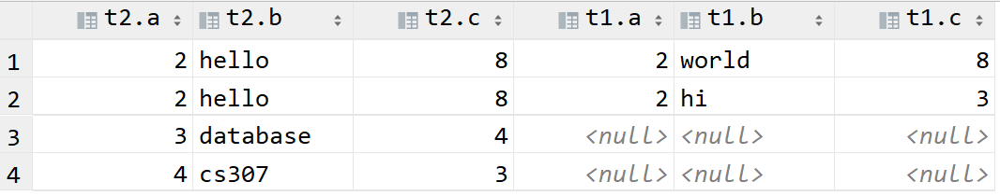
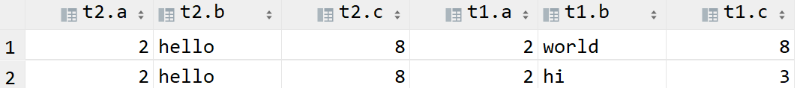

# Join and set-Operator

> Designer : ZHU Yueming in March 15th 2021

## Experimental-Objective

- Understand cross join, left join and inner join.

- Learn Set Operator

## Part 1. Cross Join, Left Join, Inner Join

*Before you start*

To create following two tables, and insert data:

```sql
create table T1(
    A int,
    B varchar(10),
    C int
);

create table T2(
    A int,
    B varchar(10),
    C int
);

insert into T1 values(1,'hello',3);
insert into T1 values(2,'world',8);
insert into T1 values(2,'hi',3);

insert into T2 values(3,'database',4);
insert into T2 values(2,'hello',8);
insert into T2 values(4,'cs307',3);
```

### 1. Cross Join

Combine each rows in the left table with each rows in the right table. (Cartesian product)

```sql
select * from T1 cross join T2;
```

Two tables:


Result:


### 2. Outer Join

- **Left outer join (left join)**: Keep all rows in the left table and combine matched rows in the right table.
- **Right outer join (right join)**: Keep all rows in the right table and combine matched rows in the left table. it can be always rewritten in left outer join.
- **Full outer join (full join)**: Keep all rows in both side.

#### Left Join example:

```sql
select * from T1 left join T2 on T1.A=T2.A;
```

Two tables:


Result:


#### Right Join example:

```sql
select * from T2 left join T1 on T1.A = T2.A;
or
select * from T1 right join T2 on T1.A = T2.A;
```

Two tables:


Result:



#### Full Join example:

```sql
select * from T1 full outer join T2 on T1.A = T2.A;
```

Two tables:


Result:


### 3. Inner Join (join)

Combine matched rows under specific conditions from two or more tables.

```sql
select * from T1 join T2 on T1.A = T2.A;
```

Two tables:


 Result:


The rows in result sets for the join clause are the same for those two situations: ```T1 join T2```  and ```T2 join T1```

```sql
select * from T2 join T1 on T2.A = T1.A;
```

Result:



### 4. Comparison of JOIN and LEFT JOIN: AND WHERE

The AND clause in the ```left join``` serves as the conditions of combination, so that the result set would remain all rows in the left table with the matched rows under the join conditions of the right table. While WHERE clause in the ```left join``` serves as the selection of the final result sets, which can filter rows  dissatisfied of WHERE clause. 

```sql
 select * from T1 left join T2 on T1.A = T2.A and T1.C=3;
 select * from T1 left join T2 on T1.A = T2.A where T1.C=3;
```

Two tables:


Result of upper one:


Result of lower one:


The ```AND``` clause in ```inner join``` serves as the filter conditions, which can only remain the combine rows that satisfied of two (or more) tables, so that ```AND``` does similar effect as the ```WHERE```. The result set of following two queries are the same.

```sql
select * from T1  join T2 on T1.A = T2.A and T1.C=3;
select * from T1 join T2 on T1.A = T2.A where T1.C=3;
```

Two tables:


Result:


