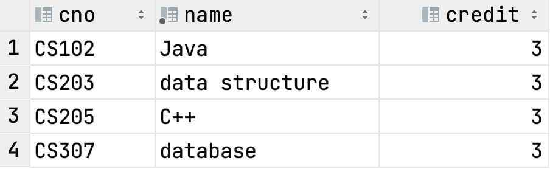

# Tutorial Advanced Join

> Designed by ZHU Yueming in Feb. 22th 2022.
>
> Update by ZHU Yueming in Mar. 30th 2022.
>
> Reference by  Stephane Faroult's Material. 

## Experimental-Objective

- Learn Set Operator
- Exists and In

## Part 1. Set Operator

Before you start, you can create two tables as following queries:

Create two tables named ```course``` and ```course_selected```

```sql
create table course
(
    cno    varchar(5) primary key,
    name   varchar not null,
    credit integer not null
);

create table course_selected
(
    id    serial primary key,
    sno   varchar(8) not null,
    cno   varchar(5) not null
        constraint cno_fk
            references course (cno),
    grade integer,
    date  date       not null
);
```

Insert data into those two tables:

```sql
insert into course(cno, name, credit)
VALUES ('CS307', 'database', 3);
insert into course(cno, name, credit)
VALUES ('CS102', 'Java', 3);
insert into course(cno, name, credit)
VALUES ('CS205', 'C++', 3);
insert into course(cno, name, credit)
VALUES ('CS203', 'data structure', 3);

insert into course_selected(sno, cno, grade, date)
values ('12000001', 'CS102', 59, '2020/5/1');
insert into course_selected(sno, cno, grade, date)
values ('12000001', 'CS102', 60, '2021/3/1');
insert into course_selected(sno, cno, grade, date)
values ('12000001', 'CS203', 75, '2021/3/1');
insert into course_selected(sno, cno, grade, date)
values ('12000001', 'CS307', 100, '2021/3/1');
insert into course_selected(sno, cno, grade, date)
values ('12000002', 'CS102', 60, '2021/5/1');
insert into course_selected(sno, cno, grade, date)
values ('12000002', 'CS203', 87, '2021/3/1');
insert into course_selected(sno, cno, grade, date)
values ('12000002', 'CS205', 96, '2021/3/1');
```


In this case, we can find that:

Student '12000001' selected following courses:


Student '12000002' selected following courses:


### 1. Union

Combine two result set into one, and remove the duplicate rows.

Compare to UNION ALL, UNION will see a duplicate.

*Example:*

```sql
select c.*
   from course_selected cs
           join course c on cs.cno = c.cno
   where cs.sno = '12000001' 
union
select c.*
 from course_selected cs
          join course c on cs.cno = c.cno
 where cs.sno = '12000002';
```

*Result:*



### 2. Union ALL

Combine two result set into one directly. When you know that, the two result sets cannot have any duplicates, then you don’t need to go through the step of duplicate removal, which is costly, in this case you'd better using union all instead of union.

*Example:*

```sql
select c.*
   from course_selected cs
           join course c on cs.cno = c.cno
   where cs.sno = '12000001' 
union all
select c.*
 from course_selected cs
          join course c on cs.cno = c.cno
 where cs.sno = '12000002';
```

*Result:*


### 3. Except

Return the rows from the first result set, minus those that can also be found in the second result set.

*Example:*

```sql
select c.*
   from course_selected cs
           join course c on cs.cno = c.cno
   where cs.sno = '12000001' 
except
select c.*
 from course_selected cs
          join course c on cs.cno = c.cno
 where cs.sno = '12000002';
```

*Result:*


### 4. Intersect

Returns= the common rows in two result sets.

*Example:*

```sql
select c.*
   from course_selected cs
           join course c on cs.cno = c.cno
   where cs.sno = '12000001' 
intersect
select c.*
 from course_selected cs
          join course c on cs.cno = c.cno
 where cs.sno = '12000002';
```

*Result:*


> Intersect  ->  inner join
>
> Except      ->  left join

## Part 2. Exists and In

*Example SQL 1. Exists:*

```sql
select *
from course c
where exists(
        select null
        from course_selected cs
        where c.cno = cs.cno and  sno = '12000002'
    )
```

If the result set of ```course_selected``` is larger than ```course```, using **Exists** is faster than **In**. The sample executing process is that for each row in outer-query, it scans the sub-query according to the matching condition, then only return the row is true or false.

The matching condition of sub-query and outer-query is ```c.cno = cs.cno and  sno = '12000002'```

Logic pseudocode:

```
for each row in course:
		//usually create index in the column course_selected.cno
		if can find one (c.cno = cs.cno and  sno = '12000002')
						resultSet.add(row)
		else 
						pass
```


*Example SQL 2. In:*

```sql
select *
from course
where cno in (
    select cno
    from course_selected
    where sno = '12000002');
```

If the result set of ```course_selected``` is smaller than following result set, , using **In** would be faster. The executing process will generate a temporary result set as follows, then for each row in course, scan each row in the temporary result set and find whether those are matched.

```sql
select cno from course_selected where sno = '12000002';
```

Logic pseudocode:

```
for each row1 in course:
		for each row2 in (select cno from course_selected where sno = '12000002') as sub:
					if(course.cno == sub.cno )
								resultSet.add(row1)
```


#### Comparation：

> The part is referenced.

| Exists                                                       | In                                                           |
| ------------------------------------------------------------ | ------------------------------------------------------------ |
| SQL Engine will stop the process as soon as it finds a single positive condition in EXISTS condition | SQL Engine compares all values in IN condition               |
| The answer of EXISTS can be TRUE or FALSE                    | The answer of IN can be TRUE or FALSE or NULL                |
| EXISTS cannot compare values between parent query and sub-query | IN compares values between parent query and sub-query        |
| It can be used to determine if any values are returned or not | IN is used as multiple OR operator                           |
| EXISTS is faster than IN if sub-query result is large        | IN is faster than EXISTS if sub-query result is less         |
| NULL can be compared using EXISTS condition                  | NULL cannot be compared using IN condition                   |
| Direct values cannot be compared using EXISTS condition. It should have sub-query with SELECT clause | IN condition can have mul;ple direct values instead of sub-query |

