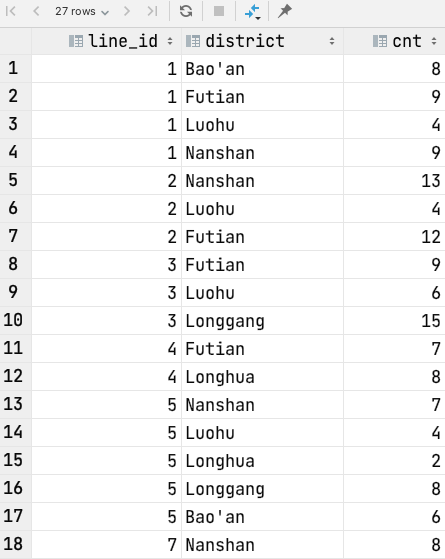
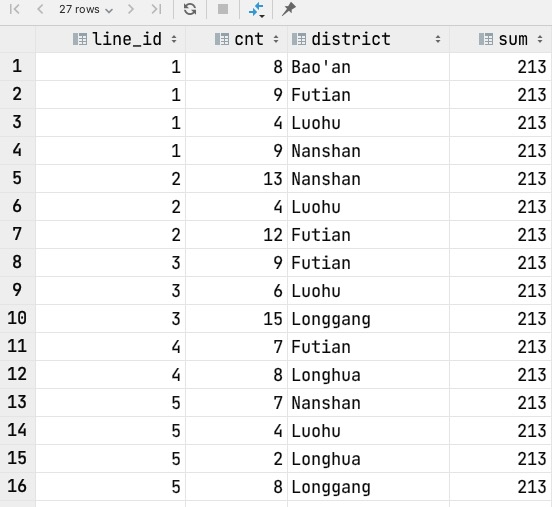
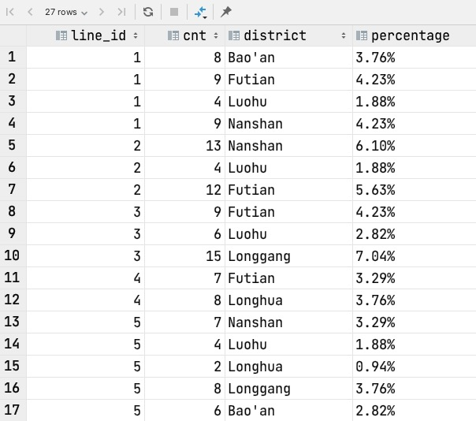
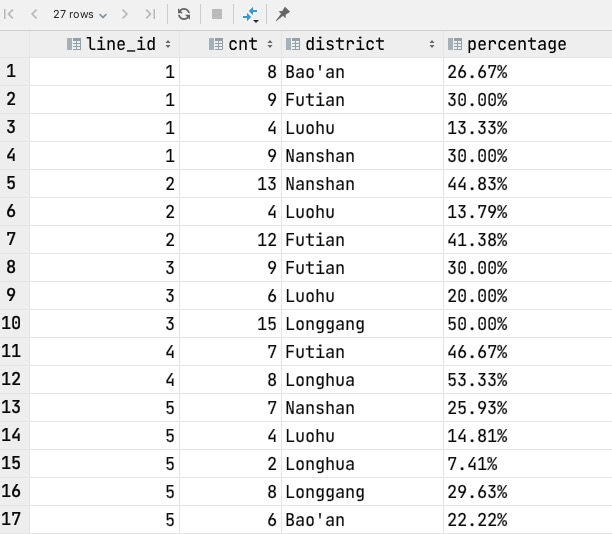
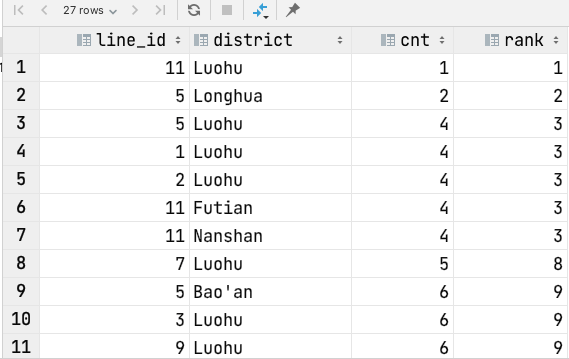
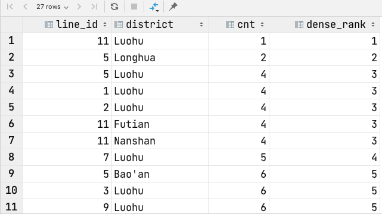
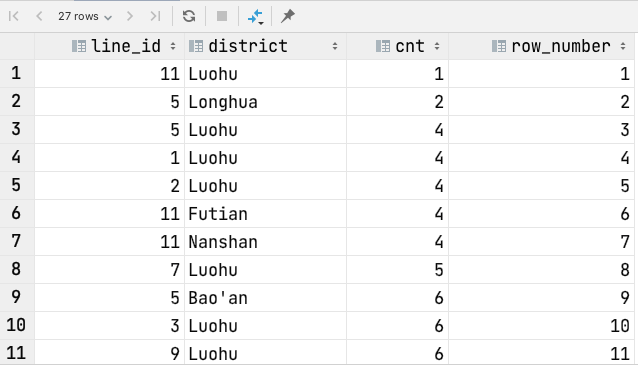
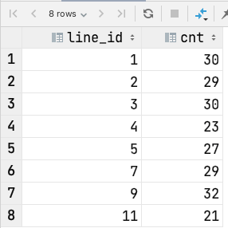
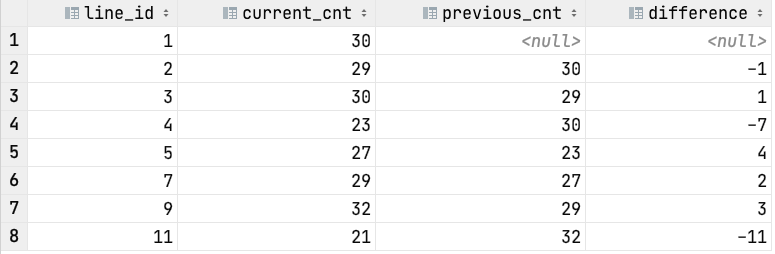

# Tutorial: Window Function

> Original designed by ZHU Yueming in 2022. Apr. 11th

## Experimental objective

- Understand basic concept of window function. Keywords like over(), partition by
- Understand how to use rank(), dense_rank(), row_number(), lag()

## Part 1. Basic use of window function

**The query below descripts a requirement that how many subway stations in each line and district? **

```sql
select line_id, district, count(*) cnt
         from line_detail l
                  join stations s on l.station_id = s.station_id
where district <> ''
         group by line_id, district
         order by line_id;
```

The result set would be:



Based on the result set above, we have another requirement that calculate the percentage of the cnt in each row to the total number of the stations. To complete the requirements, we need a total number of stations in each row, and in this case window functions would be working.

### 1. Over()

**How many stations in each line and in each district?  Return them in one row with total number of stations.**

Return the aggregate result in each row.

For example:

```sql
select line_id, cnt, district, sum(cnt) over () as sum
from (
         select line_id, district, count(*) cnt
         from line_detail l
                  join stations s on l.station_id = s.station_id
         where district <> ''
         group by line_id, district
         order by line_id) sub;
```

Result:



After that, if we want **display the percentage**, we need wrapper another select query.

```sql
select line_id, cnt, district, round(cnt * 100.0 / sum,2) ||'%' percentage
from (
         select line_id, cnt, district, sum(cnt) over () as sum
         from (
                  select line_id, district, count(*) cnt
                  from line_detail l
                           join stations s on l.station_id = s.station_id
                  where district <> ''
                  group by line_id, district
                  order by line_id) sub) sub2;
```

Result:



### 2. Partition by 

Based on the result of pervious part, if the percentage we want is **the total number of stations in current line and in current district but not the total number of the whole stations**, we need add condition in ```over()```

```sql
select line_id, cnt, district, round(cnt * 100.0 / sum,2) ||'%' percentage
from (
         select line_id, cnt, district, sum(cnt) over (partition by line_id) as sum
         from (
                  select line_id, district, count(*) cnt
                  from line_detail l
                           join stations s on l.station_id = s.station_id
                  where district <> ''
                  group by line_id, district
                  order by line_id) sub) sub2;
```

Result:



### 3. Rank(), dense_rank(), row_number()

The following example can help to distinguish the usage of ```rank()```, ```dense_rank()``` and ```row_number()```

#### 3.1 Rank()

**Given a rank number of the ascending order about the number of stations in each line and in each district.**

```sql
select *, rank() over(order by cnt)
from (
         select line_id, district, count(*) cnt
         from line_detail l
                  join stations s on l.station_id = s.station_id
         where district <> ''
         group by line_id, district
         order by line_id) sub;
```

Result:



#### 3.2 Dense_rank()

```sql
select *, dense_rank() over(order by cnt)
from (
         select line_id, district, count(*) cnt
         from line_detail l
                  join stations s on l.station_id = s.station_id
         where district <> ''
         group by line_id, district
         order by line_id) sub;
```



#### 3.3 Row_number()

```sql
select *, row_number()  over(order by cnt)
from (
         select line_id, district, count(*) cnt
         from line_detail l
                  join stations s on l.station_id = s.station_id
         where district <> ''
         group by line_id, district
         order by line_id) sub;
```

Result:



### 4. Lag()

It can return the value of the nth previous line. 

```
lag(column_name, previous_n_row)
```

Original query about the count of stations in each line :

```sql
select line_id, count(*) cnt
         from line_detail
         group by line_id
         order by line_id
```

Result:



Example requirement: **find the difference of the count of stations in current line and the count of stations in previous line**.

```sql
select *, current_cnt - previous_cnt as difference
from (
         select *, lag(current_cnt, 1) over () as previous_cnt
         from (
                  select line_id, count(*) current_cnt
                  from line_detail
                  group by line_id
                  order by line_id) sub) sub2;
```

Result:

