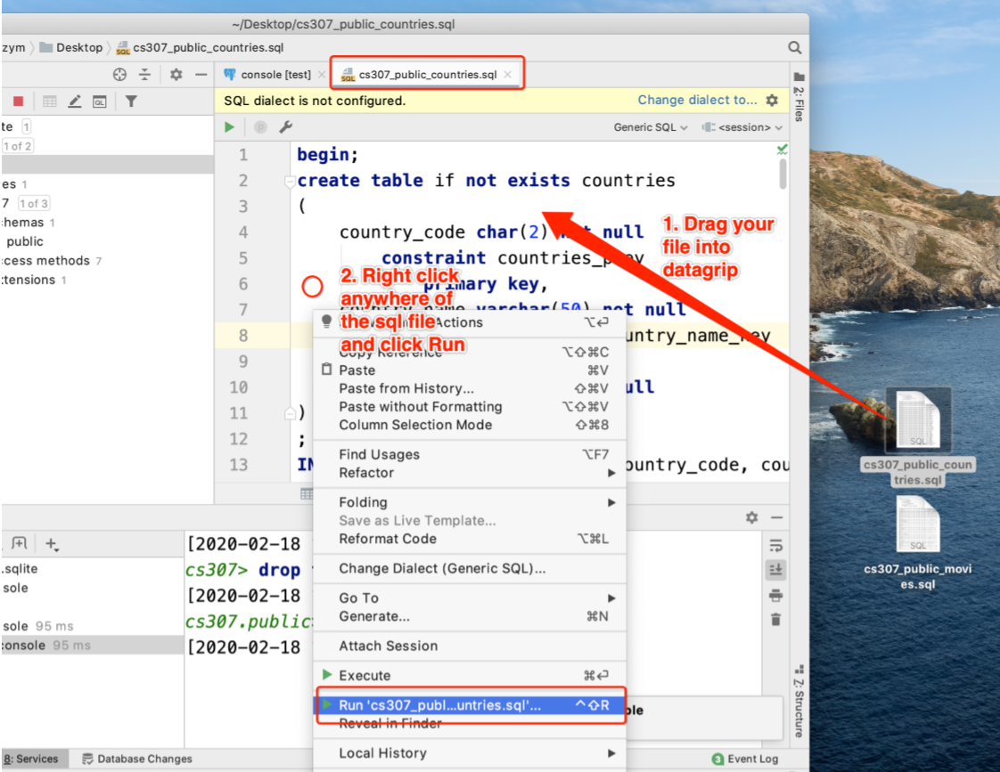
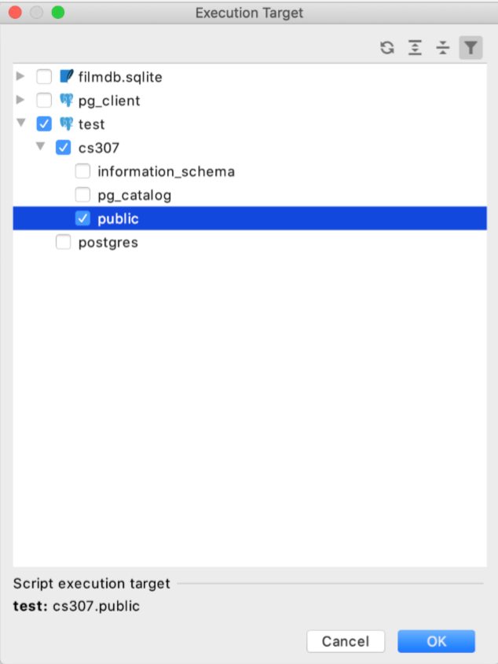
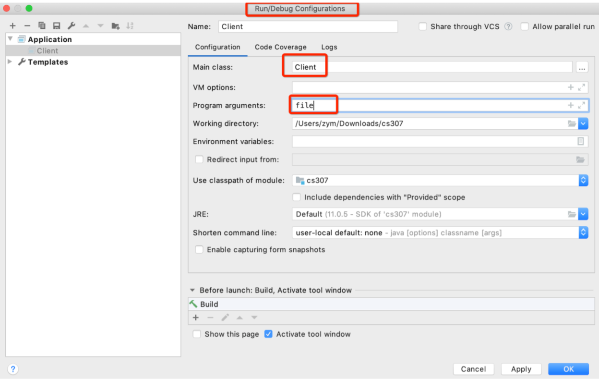
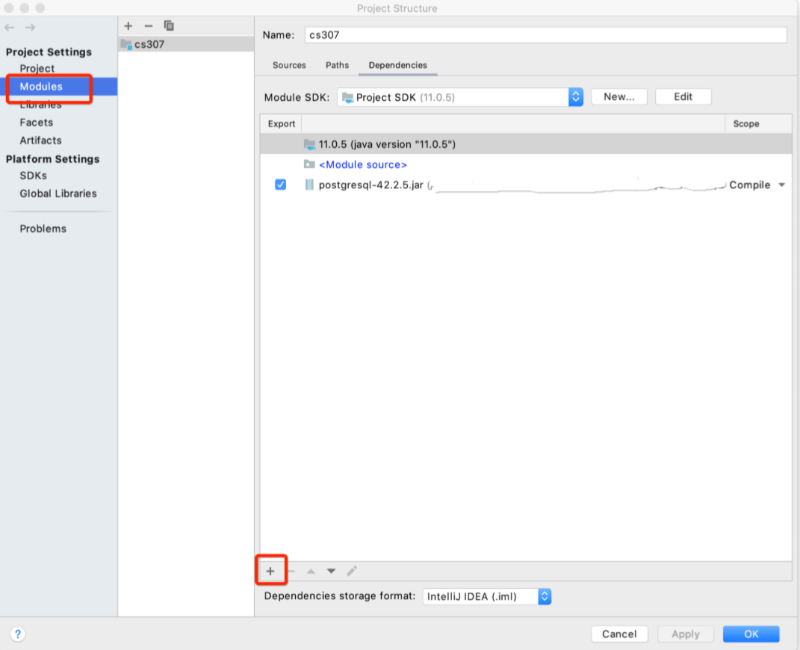
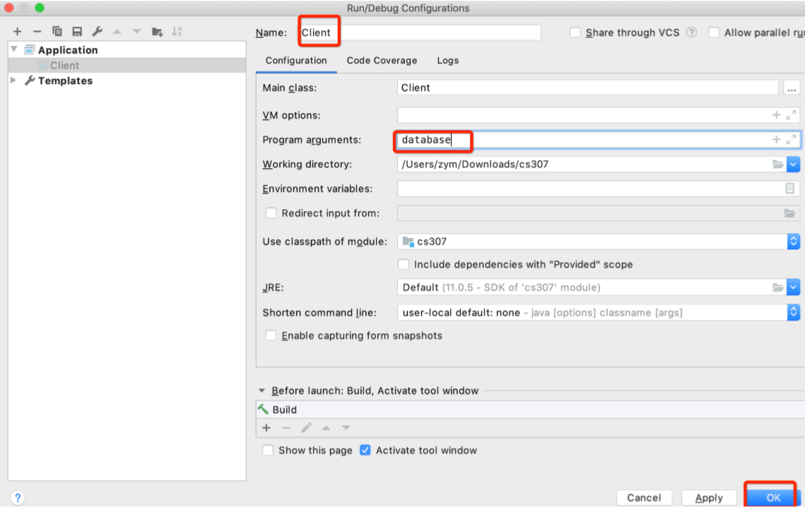
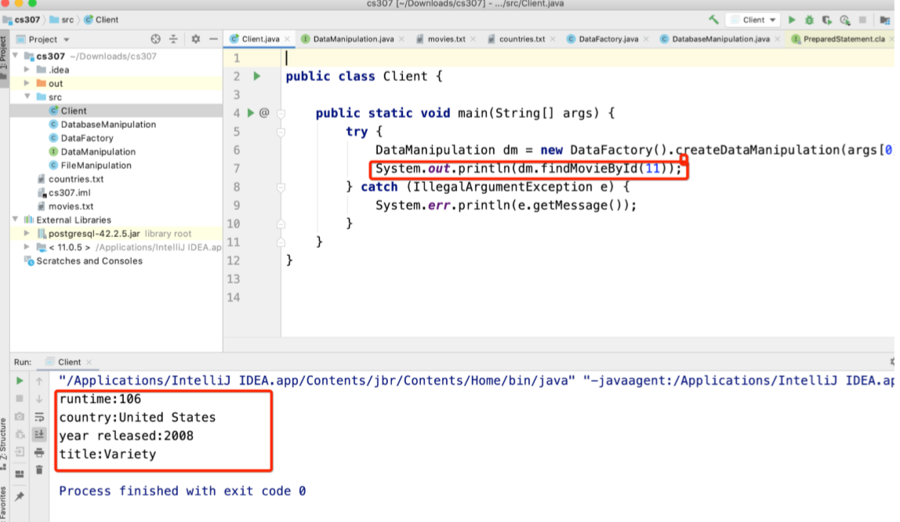

# Tutorial:  DB and File

> Designed by ZHU Yueming and PAN Chao in 2020


## DB and File Experimental objective

- Analyze that, compare with file, what is the advantage and disadvantage of database .
-  Learn how to import data from .sql files.
-  Learn how to build the jdbc program according to the source code. 
- In this lab, you do not need to understand meaning of those sql statements.

### Before your work thinking some question

The following questions are based on processing data by using file system. In this project we only have two .txt files including movies.txt and countries.txt.

1. If we want to add a new movie into movies.txt, what should we do? 
2. If we want to get all continent names from countries.txt, what should we do? 
3. Suppose that only get the continent names is not enough, and we need continent names with how many countries in each continent, what should we do? 
4. More requirements, if we need the information including title of movie, the country name, the continent and the runtime of all movies according to a specific range of runtime, in this case, we have to fetch data from two txt files. What should we do?
5.  If we have other requirements, how can we accomplish them?

## Import Data 

### 1. By Datagrip 

1. Drag your cs307_public_countries.sql into datagrip



2. Execute .sql file in target database.



3. Similar way to import cs307_public_movies.sql

### 2. By CLI

1. Connect database

   ```bash
   psql -U checker -d cs307 -h 127.0.0.1 -p 5432
   ```

   

2. Execute cs307_public_countries.sql

   ```bash
   \i [your_path_of_cs307_public_countries].sql
   ```

   

3. Execute cs307_public_movies.sql

   ```
   \i [your_path_of_cs307_public_movies].sql
   ```

### Test your import 

Execute:

```sql
select count(*) from movies;
```

result: 9538

```sql
select count(*) from countries;
```

result: 185

## Build Your Project

### 1. By Intellij IDEA

In this tutorial, we use intellij idea as IDE, and you can also do it by other way.

- Drag four .java files into src (generated sources root ) folder. 

- Drag two .txt files into your project folder.

-  Run Client.java 

  It will meet an exception as follows. Exception in thread "main" java.lang.ArrayIndexOutOfBoundsException:…… 

- Setting Configurations 

  <font color='RED'>Run -> Edit Configurations -> Configuration -> Program arguments</font>



- Run again the result would be

  ```
  ASIA
  EUROPE 
  AFRICA 
  AMERICA 
  OCEANIA
  
  EUROPE  40 
  AFRICA  52 
  ......
  ```

  

- Import postgres Driver into your project.

  <font color='RED'>File -> Project Structure -> Modules -> '+' -> Jar or directories -> browse your driver path</font>

  

- Change Program argument to **database**

  

  

### By CLI

- Make sure your computer has java and javac environment. 

- Put all your .java files, .txt files and postgreSQL driver into one folder 

- Compile:

  ```
  javac Client.java 
  javac FileManipulation.java 
  javac DatabaseManipulation.java
  ```

- Run file manipulation:

  ```
  java Client file
  ```

- Run database manipulation 

  Linux or Mac

  ```
  java -cp .:postgresql-42.2.5.jar Client database
  ```

  Windows

  ```
java -cp .;postgresql-42.2.5.jar Client database
  ```

## Exercise

- Try the query

  ```sql
  select m.title, c.country_name, m.year_released, m.runtime from movies m
  	join countries c             
      	on m.country = c.country_code 
  where m.movieid = 5;
  ```

- Add a method named findMovieById(int id)

- According to the code given to you, please implement method findMovieById in DatabaseManipulation.   The result would be:

  

  Tips: You can use executeQuery() method to execute the query in prepare statement, and the result would stored in resultSet

  ```
resultSet = preparedStatement.executeQuery();
  ```
  
  If you want to find the first selecting result in resultSet, you can do:

  ```
resultSet.next();
  ```
